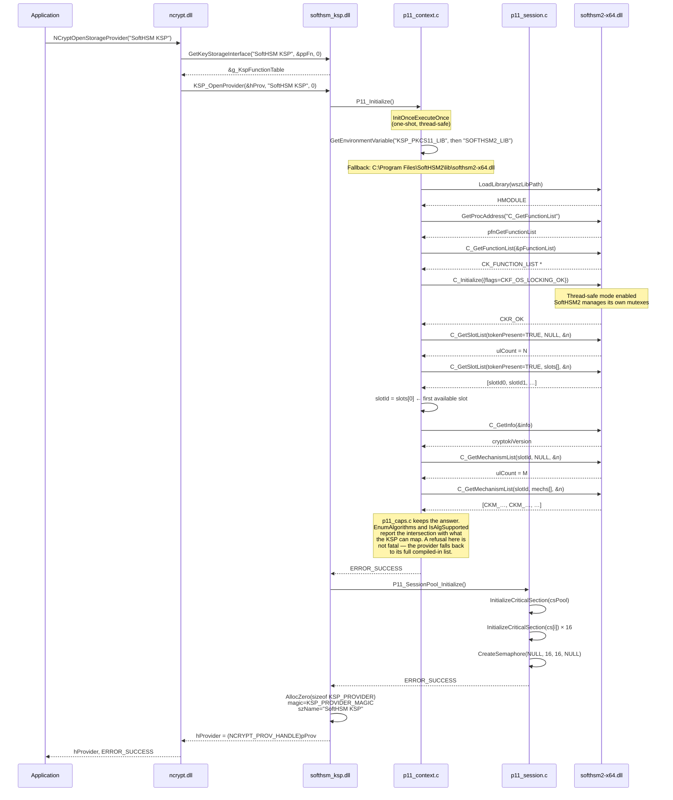
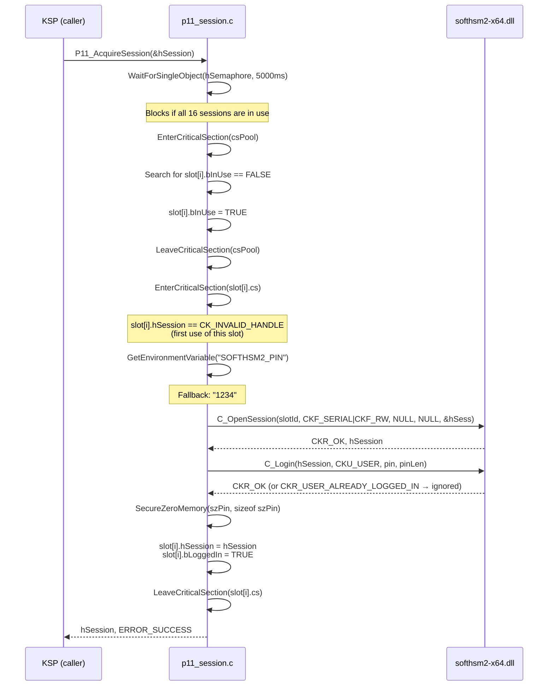
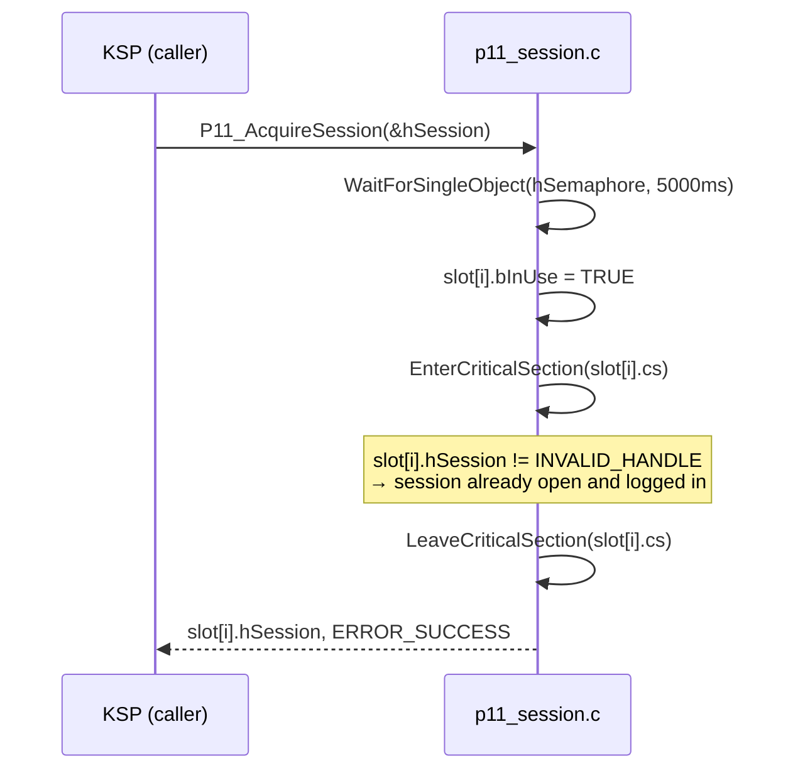
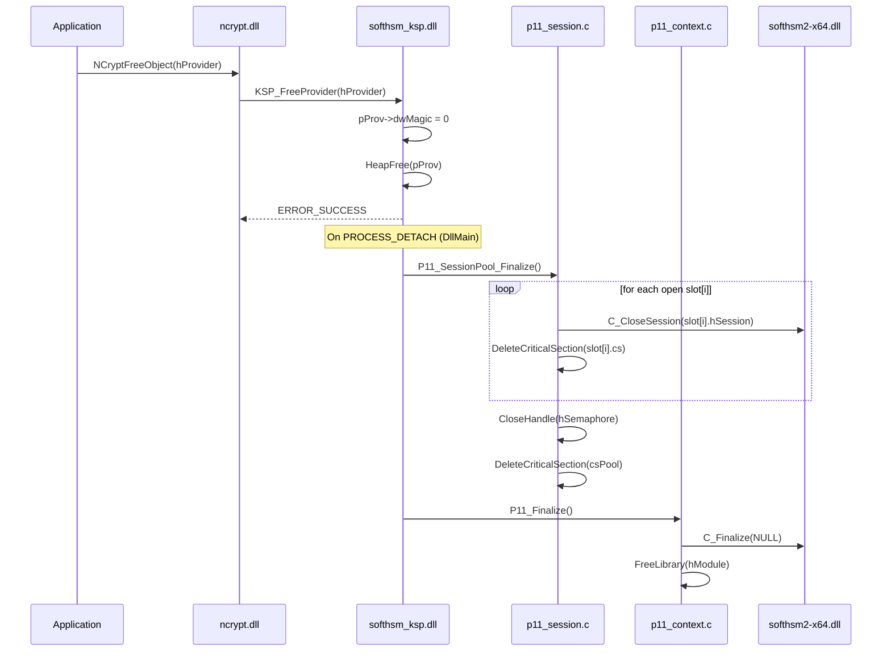

# Initialisation — Loading and connecting to SoftHSM2

## Overview

Initialisation is **lazy and idempotent**: it occurs only once per process,
on the first call to `KSP_OpenProvider()`.
Windows `InitOnceExecuteOnce` guarantees that even with N threads calling
simultaneously, the initialisation code runs exactly once.

---

## Sequence diagram — First OpenProvider

---

## Sequence diagram — Session acquisition (first time)

---

## Sequence diagram — Acquisition (session already open)

---

## Sequence diagram — Release and FreeProvider

---

## Initialisation return codes

| Condition | SECURITY_STATUS code |
|-----------|---------------------|
| `LoadLibrary` fails (DLL not found) | `NTE_PROVIDER_DLL_FAIL` |
| `C_GetFunctionList` not found | `NTE_PROVIDER_DLL_FAIL` |
| `C_Initialize` fails | `P11RvToSecStatus(rv)` |
| No slot with token present | `NTE_NO_KEY` |
| `CreateSemaphore` fails | `NTE_NO_MEMORY` |
| Success | `ERROR_SUCCESS` |

---

## Environment variables

| Variable | Default | Usage |
|----------|---------|-------|
| `KSP_PKCS11_LIB` | — | Full path to the PKCS#11 module. Read first; any v2.40+ module works |
| `SOFTHSM2_LIB` | `C:\Program Files\SoftHSM2\lib\softhsm2-x64.dll` | The older name for the same setting, read when `KSP_PKCS11_LIB` is unset |
| `SOFTHSM2_PIN` | `1234` | Token user PIN |
| `KSP_DEBUG` | `0` | `1` = enables `OutputDebugString` |

> **Security**: the PIN is erased from memory immediately after `C_Login()`
> via `SecureZeroMemory()` to prevent it from lingering on the heap.

---

## Session recovery

A pooled session is long-lived, and plenty can happen to it between one
operation and the next: the token can be removed and reinserted, another
process can call `C_Finalize`, or an administrator can log the token out.
The handle stays **numerically valid** through all of that, so the first
symptom used to be a confusing `CKR_USER_NOT_LOGGED_IN` from whatever
operation happened to run next.

`P11_AcquireSession` therefore validates a cached session before handing it
out, with `C_GetSessionInfo` — one cheap call that answers both questions:

| Result | Action |
|--------|--------|
| `CKR_OK`, state `CKS_RW_USER_FUNCTIONS` or `CKS_RO_USER_FUNCTIONS` | Reuse the session |
| `CKR_OK`, any public state | Token logged out — close and reopen |
| Any error (`CKR_SESSION_HANDLE_INVALID`, `CKR_SESSION_CLOSED`, …) | Handle is gone — discard and reopen |

Reopening re-runs the full login, so the credential set through
`NCRYPT_PIN_PROPERTY` is used again. A healthy session is **not** reopened:
recovery that fired every time would cost a login per operation, and
`test_p11_session.c` asserts that it does not.
