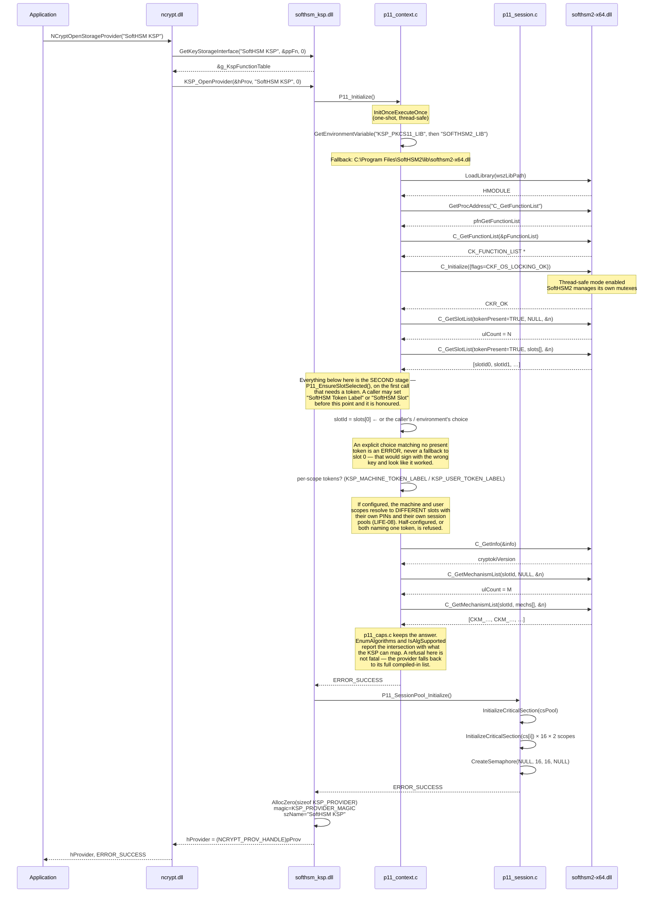
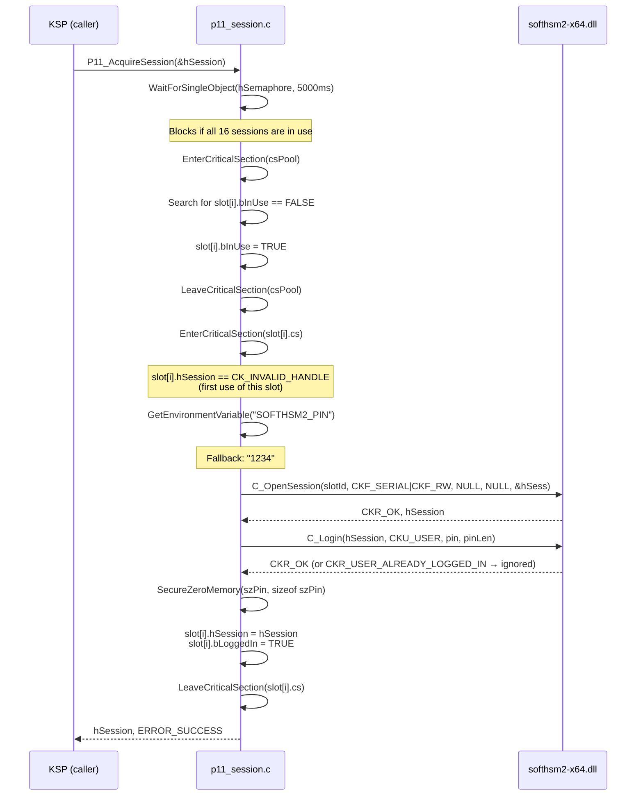
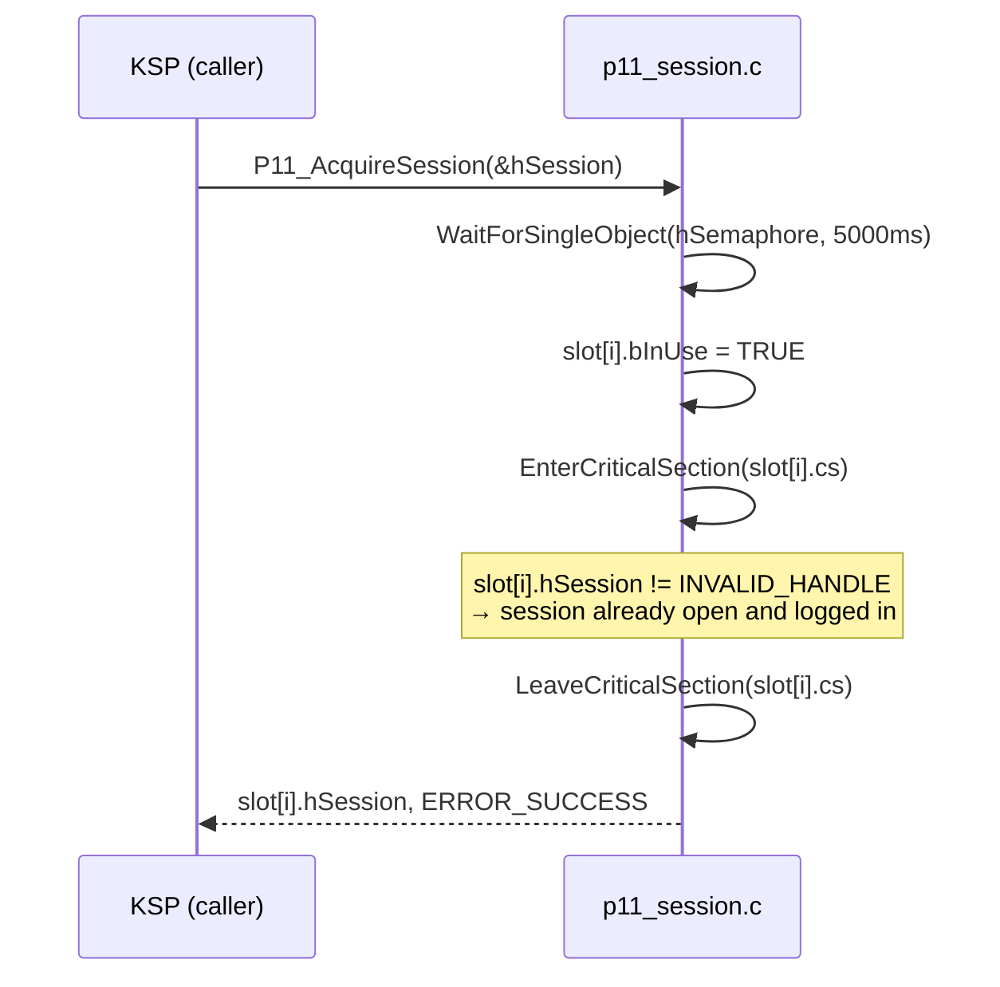
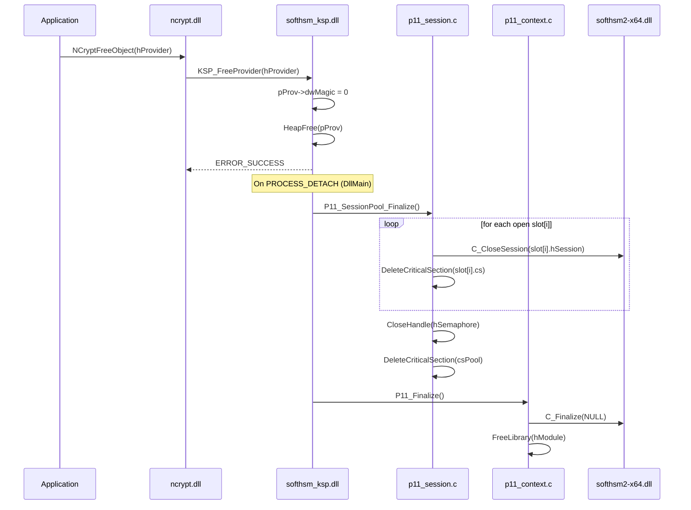

# Initialisation — Loading and connecting to SoftHSM2

## Overview

Initialisation is **lazy and idempotent**, and it happens in **two stages**
rather than one.

`KSP_OpenProvider` triggers the first: load the module, `C_GetFunctionList`,
`C_Initialize`. None of that needs a token.

Choosing the slot and probing the token are the second stage, and they run
on the **first call that actually needs a token** — acquiring a session, or
answering a capability question such as `NCryptEnumAlgorithms`.

**That split is the point, not an optimisation.** Doing it all at once meant
the session pool was bound to a slot by the time a caller held a provider
handle, so `NCryptSetProperty` could not be used to choose the token and had
to refuse. Deferring the binding opens a window between
`NCryptOpenStorageProvider` and the first operation in which the choice is
still available — exactly the window the PIN has always used. See
`05-properties.md`.

The guard is a critical section rather than `InitOnceExecuteOnce`: a
*successful* initialisation stays one-shot, but a *failed* one is retried,
so one bad module path no longer poisons the provider for the life of the
host process (OPS-08).

---

## Sequence diagram — First OpenProvider

```mermaid
sequenceDiagram
    participant App as Application
    participant NCrypt as ncrypt.dll
    participant KSP as softhsm_ksp.dll
    participant P11Ctx as p11_context.c
    participant Pool as p11_session.c
    participant HSM as softhsm2-x64.dll

    App->>NCrypt: NCryptOpenStorageProvider("SoftHSM KSP")
    NCrypt->>KSP: GetKeyStorageInterface("SoftHSM KSP", &ppFn, 0)
    KSP-->>NCrypt: &g_KspFunctionTable

    NCrypt->>KSP: KSP_OpenProvider(&hProv, "SoftHSM KSP", 0)

    KSP->>P11Ctx: P11_Initialize()
    note over P11Ctx: InitOnceExecuteOnce<br/>(one-shot, thread-safe)

    P11Ctx->>P11Ctx: GetEnvironmentVariable("KSP_PKCS11_LIB", then "SOFTHSM2_LIB")
    note over P11Ctx: Fallback: C:\Program Files\SoftHSM2\lib\softhsm2-x64.dll

    P11Ctx->>HSM: LoadLibrary(wszLibPath)
    HSM-->>P11Ctx: HMODULE

    P11Ctx->>HSM: GetProcAddress("C_GetFunctionList")
    HSM-->>P11Ctx: pfnGetFunctionList

    P11Ctx->>HSM: C_GetFunctionList(&pFunctionList)
    HSM-->>P11Ctx: CK_FUNCTION_LIST *

    P11Ctx->>HSM: C_Initialize({flags=CKF_OS_LOCKING_OK})
    note over HSM: Thread-safe mode enabled<br/>SoftHSM2 manages its own mutexes
    HSM-->>P11Ctx: CKR_OK

    P11Ctx->>HSM: C_GetSlotList(tokenPresent=TRUE, NULL, &n)
    HSM-->>P11Ctx: ulCount = N

    P11Ctx->>HSM: C_GetSlotList(tokenPresent=TRUE, slots[], &n)
    HSM-->>P11Ctx: [slotId0, slotId1, …]

    note over KSP,P11Ctx: Everything below here is the SECOND stage —<br/>P11_EnsureSlotSelected(), on the first call<br/>that needs a token. A caller may set<br/>"SoftHSM Token Label" or "SoftHSM Slot"<br/>before this point and it is honoured.

    P11Ctx->>P11Ctx: slotId = slots[0]  ← or the caller's / environment's choice
    note over P11Ctx: An explicit choice matching no present<br/>token is an ERROR, never a fallback to<br/>slot 0 — that would sign with the wrong<br/>key and look like it worked.

    P11Ctx->>P11Ctx: per-scope tokens? (KSP_MACHINE_TOKEN_LABEL / KSP_USER_TOKEN_LABEL)
    note over P11Ctx: If configured, the machine and user<br/>scopes resolve to DIFFERENT slots with<br/>their own PINs and their own session<br/>pools (LIFE-08). Half-configured, or<br/>both naming one token, is refused.

    P11Ctx->>HSM: C_GetInfo(&info)
    HSM-->>P11Ctx: cryptokiVersion

    P11Ctx->>HSM: C_GetMechanismList(slotId, NULL, &n)
    HSM-->>P11Ctx: ulCount = M

    P11Ctx->>HSM: C_GetMechanismList(slotId, mechs[], &n)
    HSM-->>P11Ctx: [CKM_…, CKM_…, …]
    note over P11Ctx: p11_caps.c keeps the answer.<br/>EnumAlgorithms and IsAlgSupported<br/>report the intersection with what<br/>the KSP can map. A refusal here is<br/>not fatal — the provider falls back<br/>to its full compiled-in list.

    P11Ctx-->>KSP: ERROR_SUCCESS

    KSP->>Pool: P11_SessionPool_Initialize()
    Pool->>Pool: InitializeCriticalSection(csPool)
    Pool->>Pool: InitializeCriticalSection(cs[i]) × 16 × 2 scopes
    Pool->>Pool: CreateSemaphore(NULL, 16, 16, NULL)
    Pool-->>KSP: ERROR_SUCCESS

    KSP->>KSP: AllocZero(sizeof KSP_PROVIDER)<br/>magic=KSP_PROVIDER_MAGIC<br/>szName="SoftHSM KSP"
    KSP-->>NCrypt: hProvider = (NCRYPT_PROV_HANDLE)pProv
    NCrypt-->>App: hProvider, ERROR_SUCCESS
```

---

## Sequence diagram — Session acquisition (first time)

```mermaid
sequenceDiagram
    participant KSP as KSP (caller)
    participant Pool as p11_session.c
    participant HSM as softhsm2-x64.dll

    KSP->>Pool: P11_AcquireSession(&hSession)

    Pool->>Pool: WaitForSingleObject(hSemaphore, 5000ms)
    note over Pool: Blocks if all 16 sessions are in use

    Pool->>Pool: EnterCriticalSection(csPool)
    Pool->>Pool: Search for slot[i].bInUse == FALSE
    Pool->>Pool: slot[i].bInUse = TRUE
    Pool->>Pool: LeaveCriticalSection(csPool)

    Pool->>Pool: EnterCriticalSection(slot[i].cs)
    note over Pool: slot[i].hSession == CK_INVALID_HANDLE<br/>(first use of this slot)

    Pool->>Pool: GetEnvironmentVariable("SOFTHSM2_PIN")
    note over Pool: Fallback: "1234"

    Pool->>HSM: C_OpenSession(slotId, CKF_SERIAL|CKF_RW, NULL, NULL, &hSess)
    HSM-->>Pool: CKR_OK, hSession

    Pool->>HSM: C_Login(hSession, CKU_USER, pin, pinLen)
    HSM-->>Pool: CKR_OK  (or CKR_USER_ALREADY_LOGGED_IN → ignored)

    Pool->>Pool: SecureZeroMemory(szPin, sizeof szPin)
    Pool->>Pool: slot[i].hSession = hSession<br/>slot[i].bLoggedIn = TRUE
    Pool->>Pool: LeaveCriticalSection(slot[i].cs)

    Pool-->>KSP: hSession, ERROR_SUCCESS
```

---

## Sequence diagram — Acquisition (session already open)

```mermaid
sequenceDiagram
    participant KSP as KSP (caller)
    participant Pool as p11_session.c

    KSP->>Pool: P11_AcquireSession(&hSession)
    Pool->>Pool: WaitForSingleObject(hSemaphore, 5000ms)
    Pool->>Pool: slot[i].bInUse = TRUE
    Pool->>Pool: EnterCriticalSection(slot[i].cs)
    note over Pool: slot[i].hSession != INVALID_HANDLE<br/>→ session already open and logged in
    Pool->>Pool: LeaveCriticalSection(slot[i].cs)
    Pool-->>KSP: slot[i].hSession, ERROR_SUCCESS
```

---

## Sequence diagram — Release and FreeProvider

```mermaid
sequenceDiagram
    participant App as Application
    participant NCrypt as ncrypt.dll
    participant KSP as softhsm_ksp.dll
    participant Pool as p11_session.c
    participant P11Ctx as p11_context.c
    participant HSM as softhsm2-x64.dll

    App->>NCrypt: NCryptFreeObject(hProvider)
    NCrypt->>KSP: KSP_FreeProvider(hProvider)
    KSP->>KSP: pProv->dwMagic = 0
    KSP->>KSP: HeapFree(pProv)
    KSP-->>NCrypt: ERROR_SUCCESS

    note over KSP: On PROCESS_DETACH (DllMain)

    KSP->>Pool: P11_SessionPool_Finalize()
    loop for each open slot[i]
        Pool->>HSM: C_CloseSession(slot[i].hSession)
        Pool->>Pool: DeleteCriticalSection(slot[i].cs)
    end
    Pool->>Pool: CloseHandle(hSemaphore)
    Pool->>Pool: DeleteCriticalSection(csPool)

    KSP->>P11Ctx: P11_Finalize()
    P11Ctx->>HSM: C_Finalize(NULL)
    P11Ctx->>P11Ctx: FreeLibrary(hModule)
```

---

## Initialisation return codes

| Condition | SECURITY_STATUS code |
|-----------|---------------------|
| `LoadLibrary` fails (DLL not found) | `NTE_PROVIDER_DLL_FAIL` |
| `C_GetFunctionList` not found | `NTE_PROVIDER_DLL_FAIL` |
| `C_Initialize` fails | `P11RvToSecStatus(rv)` |
| No slot with token present | `NTE_NO_KEY` |
| An explicit token selection matching nothing | `NTE_NO_KEY` |
| Per-scope tokens half-configured, or both naming one token | `NTE_NO_KEY` |
| A caller selection together with per-scope tokens | `NTE_NO_KEY` |
| `CreateSemaphore` fails | `NTE_NO_MEMORY` |
| Success | `ERROR_SUCCESS` |

The last four come from the **second** stage, so `P11_Initialize` itself
succeeds and the failure surfaces on the first operation that needs a token.
That is deliberate: loading the module and calling `C_Initialize` genuinely
did work, and reporting failure from `P11_Initialize` would blame the wrong
step. None of them bind anything, so all four are correctable in the same
process — set a label that exists, or fix the configuration, and the next
operation succeeds.

---

## Environment variables

| Variable | Default | Usage |
|----------|---------|-------|
| `KSP_PKCS11_LIB` | — | Full path to the PKCS#11 module. Read first; any v2.40+ module works |
| `SOFTHSM2_LIB` | `C:\Program Files\SoftHSM2\lib\softhsm2-x64.dll` | The older name for the same setting, read when `KSP_PKCS11_LIB` is unset |
| `SOFTHSM2_PIN` | `1234` | Token user PIN |
| `KSP_DEBUG` | `0` | `1` = enables `OutputDebugString` |

> **Security**: the PIN is erased from memory immediately after `C_Login()`
> via `SecureZeroMemory()` to prevent it from lingering on the heap.

---

## Session recovery

A pooled session is long-lived, and plenty can happen to it between one
operation and the next: the token can be removed and reinserted, another
process can call `C_Finalize`, or an administrator can log the token out.
The handle stays **numerically valid** through all of that, so the first
symptom used to be a confusing `CKR_USER_NOT_LOGGED_IN` from whatever
operation happened to run next.

`P11_AcquireSession` therefore validates a cached session before handing it
out, with `C_GetSessionInfo` — one cheap call that answers both questions:

| Result | Action |
|--------|--------|
| `CKR_OK`, state `CKS_RW_USER_FUNCTIONS` or `CKS_RO_USER_FUNCTIONS` | Reuse the session |
| `CKR_OK`, any public state | Token logged out — close and reopen |
| Any error (`CKR_SESSION_HANDLE_INVALID`, `CKR_SESSION_CLOSED`, …) | Handle is gone — discard and reopen |

Reopening re-runs the full login, so the credential set through
`NCRYPT_PIN_PROPERTY` is used again. A healthy session is **not** reopened:
recovery that fired every time would cost a login per operation, and
`test_p11_session.c` asserts that it does not.
