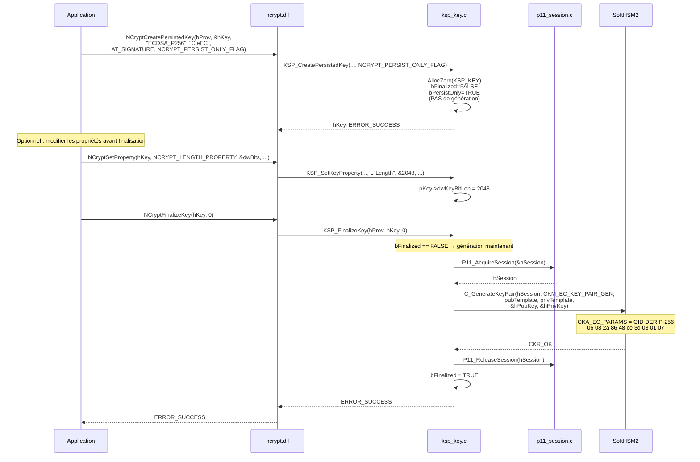
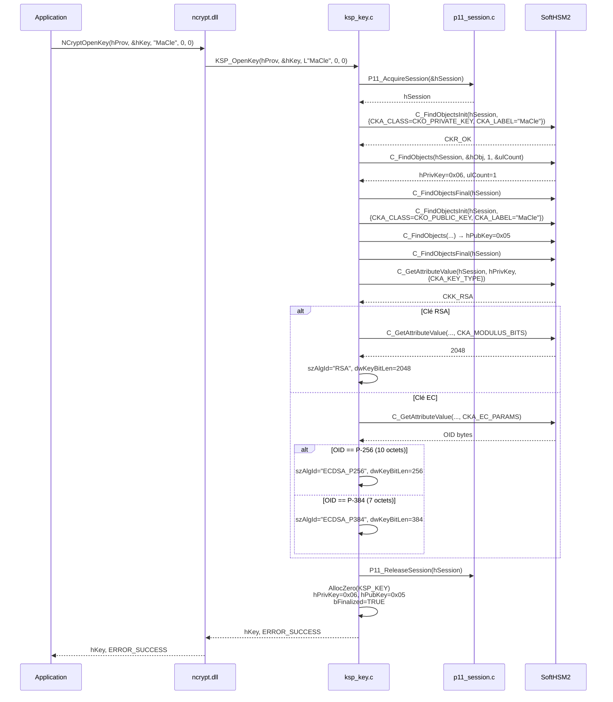
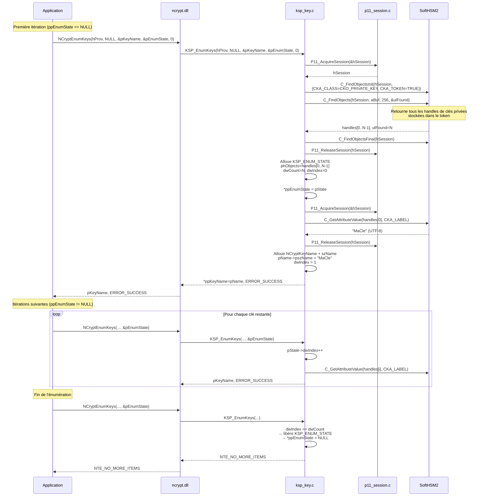
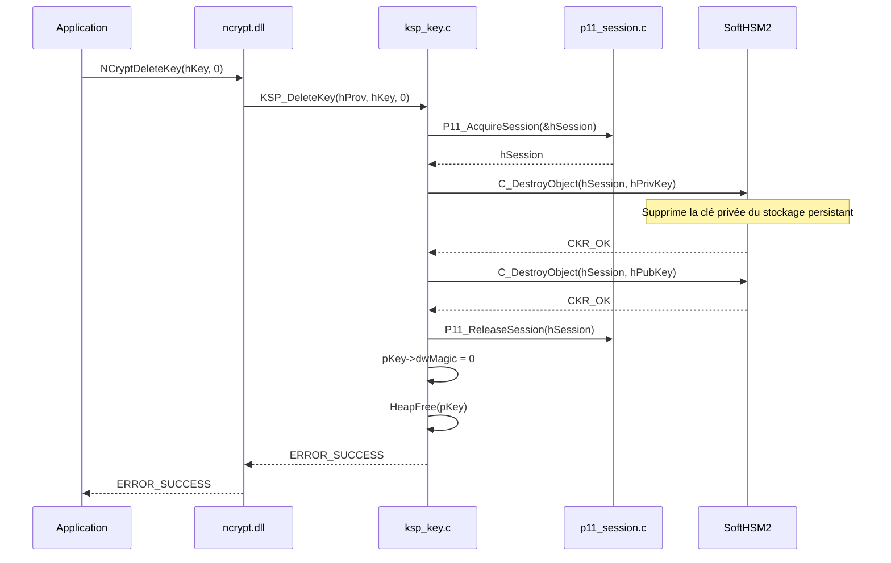

# Gestion des clés — Mapping CNG → PKCS#11

## Correspondance des concepts

| Concept CNG | Équivalent PKCS#11 | Champ KSP_KEY |
|-------------|-------------------|---------------|
| `NCRYPT_KEY_HANDLE` | `CK_OBJECT_HANDLE` (paire) | `hPrivKey` + `hPubKey` |
| Nom de clé (`pszKeyName`) | `CKA_LABEL` | `szKeyName` |
| Algorithme (`pszAlgId`) | `CKM_*_KEY_PAIR_GEN` | `szAlgId` |
| `AT_SIGNATURE` | `CKA_SIGN = TRUE` | `dwKeySpec` |
| `AT_KEYEXCHANGE` | `CKA_DECRYPT = TRUE` | `dwKeySpec` |
| Clé persistante | `CKA_TOKEN = TRUE` | implicite |
| Non exportable | `CKA_EXTRACTABLE = FALSE` | implicite |

---

## CreatePersistedKey — RSA

---

## CreatePersistedKey — ECDSA P-256 (mode différé)

---

## OpenKey — Réouverture d'une clé existante

---

## EnumKeys — Énumération paginée

---

## DeleteKey

---

## OIDs DER des courbes elliptiques

Les courbes sont identifiées par leur OID encodé en DER passé dans `CKA_EC_PARAMS` :

| Courbe | OID | Encodage DER |
|--------|-----|-------------|
| P-256 (secp256r1) | 1.2.840.10045.3.1.7 | `06 08 2A 86 48 CE 3D 03 01 07` (10 octets) |
| P-384 (secp384r1) | 1.3.132.0.34 | `06 05 2B 81 04 00 22` (7 octets) |

À la lecture (`OpenKey`), la longueur du blob OID suffit à distinguer les courbes :
- 10 octets → P-256
- 7 octets → P-384
