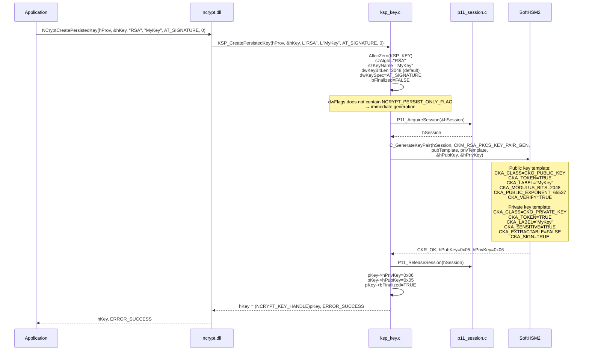
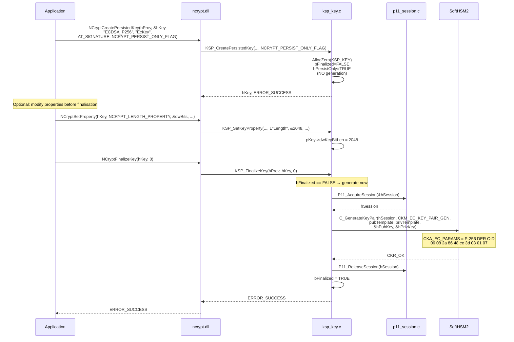
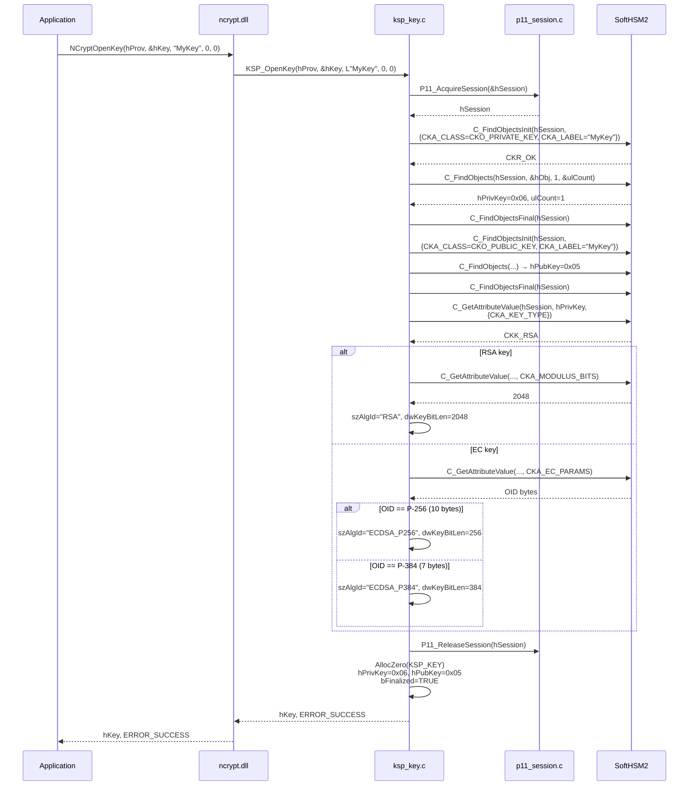
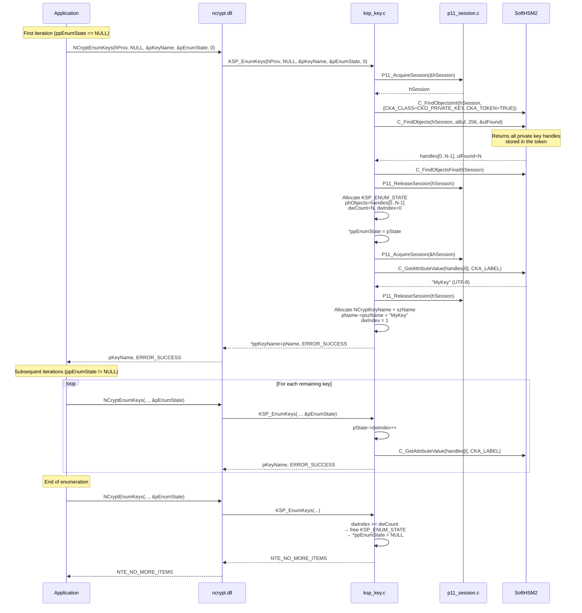

# Key management — CNG → PKCS#11 mapping

## Concept mapping

| CNG concept | PKCS#11 equivalent | KSP_KEY field |
|-------------|-------------------|---------------|
| `NCRYPT_KEY_HANDLE` | `CK_OBJECT_HANDLE` (pair) | `hPrivKey` + `hPubKey` |
| Key name (`pszKeyName`) | `CKA_LABEL` | `szKeyName` |
| Algorithm (`pszAlgId`) | `CKM_*_KEY_PAIR_GEN` | `szAlgId` |
| `AT_SIGNATURE` | `CKA_SIGN = TRUE` | `dwKeySpec` |
| `AT_KEYEXCHANGE` | `CKA_DECRYPT = TRUE` | `dwKeySpec` |
| Persistent key | `CKA_TOKEN = TRUE` | implicit |
| Non-exportable | `CKA_EXTRACTABLE = FALSE` | implicit |

---

## CreatePersistedKey — RSA

---

## CreatePersistedKey — ECDSA P-256 (deferred mode)

---

## OpenKey — Reopening an existing key

---

## EnumKeys — Paginated enumeration

---

## DeleteKey

---

## DER OIDs for elliptic curves

Curves are identified by their DER-encoded OID passed in `CKA_EC_PARAMS`:

| Curve | OID | DER encoding |
|-------|-----|-------------|
| P-256 (secp256r1) | 1.2.840.10045.3.1.7 | `06 08 2A 86 48 CE 3D 03 01 07` (10 bytes) |
| P-384 (secp384r1) | 1.3.132.0.34 | `06 05 2B 81 04 00 22` (7 bytes) |

When reading (`OpenKey`), the OID blob length is sufficient to distinguish curves:
- 10 bytes → P-256
- 7 bytes → P-384
