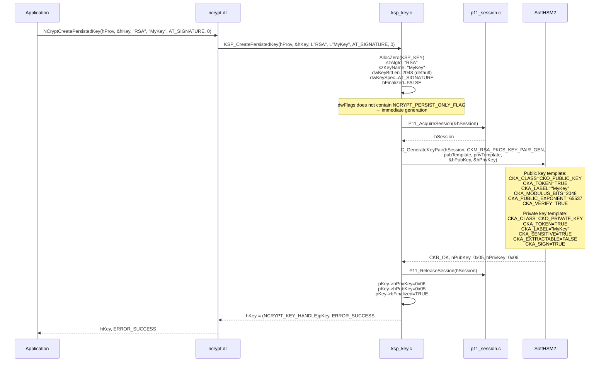
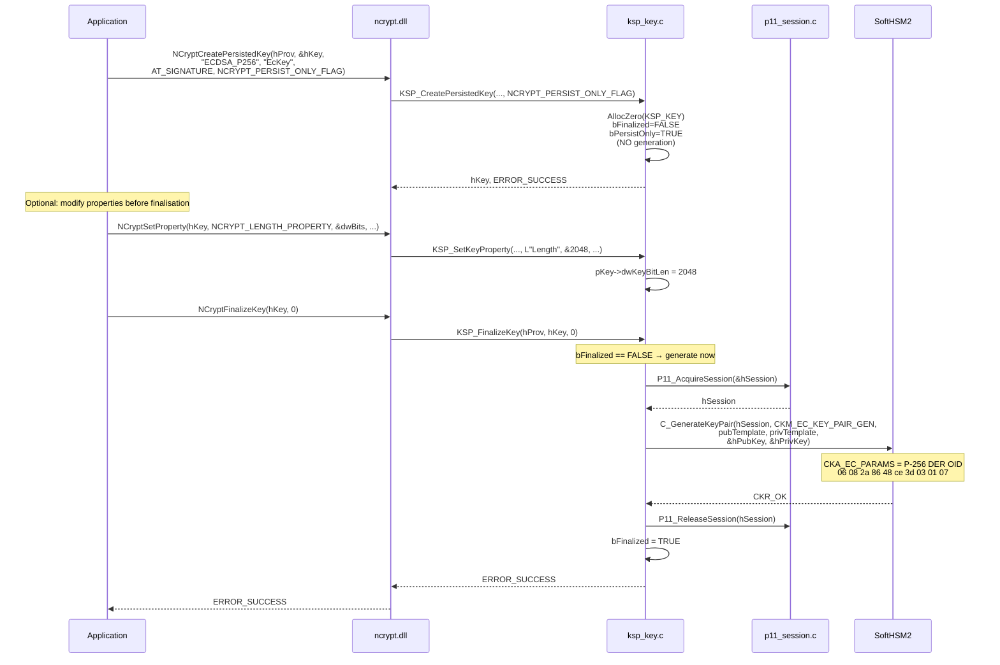
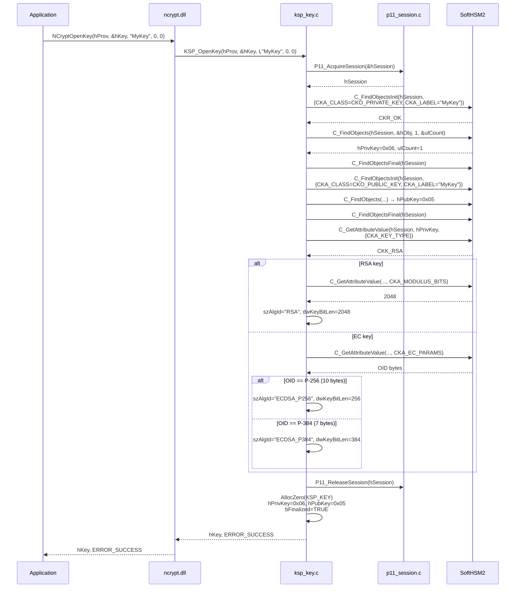
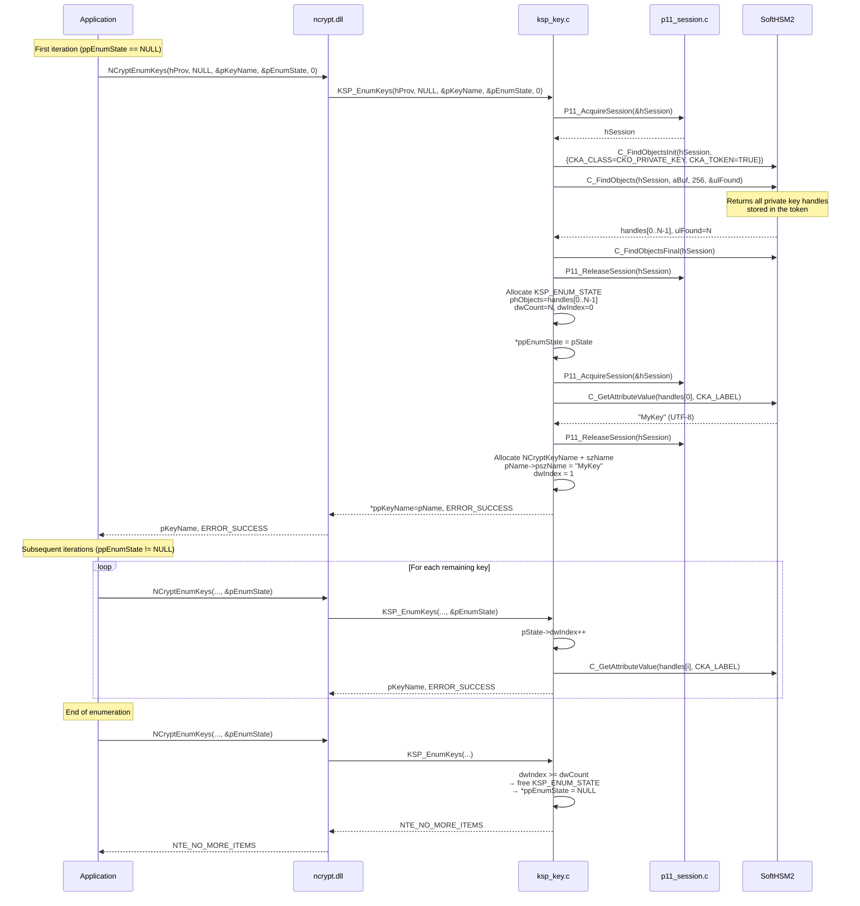
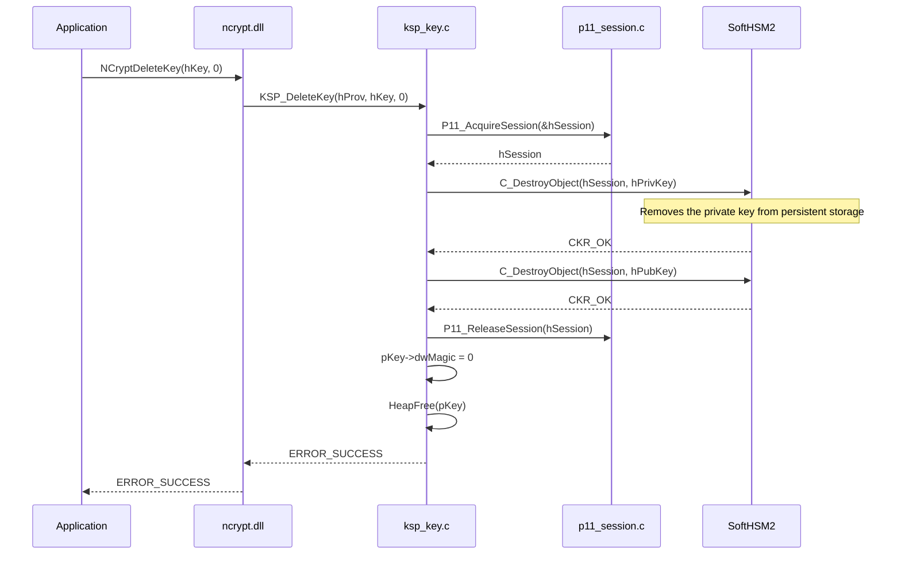

# Key management — CNG → PKCS#11 mapping

## Concept mapping

| CNG concept | PKCS#11 equivalent | KSP_KEY field |
|-------------|-------------------|---------------|
| `NCRYPT_KEY_HANDLE` (asymmetric) | `CK_OBJECT_HANDLE` (pair) | `hPrivKey` + `hPubKey` |
| `NCRYPT_KEY_HANDLE` (symmetric) | `CK_OBJECT_HANDLE` (secret) | `hSecretKey` |
| `NCRYPT_SECRET_HANDLE` | `CKO_SECRET_KEY` from `C_DeriveKey` | `KSP_SECRET.hSecretObj` |
| Key name (`pszKeyName`) | `CKA_LABEL` | `szKeyName` |
| Algorithm (`pszAlgId`) | `CKM_*_KEY_GEN` / `CKM_*_KEY_PAIR_GEN` | `szAlgId` |
| `AT_SIGNATURE` | `CKA_SIGN = TRUE` | `dwKeySpec` |
| `AT_KEYEXCHANGE` (RSA) | `CKA_DECRYPT = TRUE` | `dwKeySpec` |
| `AT_KEYEXCHANGE` (ECDH) | `CKA_DERIVE = TRUE` | `dwKeySpec` |
| Persistent key | `CKA_TOKEN = TRUE` | implicit |
| Non-exportable | `CKA_EXTRACTABLE = FALSE` | implicit |

---

## Supported algorithm families

`KSP_CreatePersistedKey` validates `pszAlgId` against five families. The
classifiers in `ksp_key.c` (`KSP_IsEcdsaAlg`, `KSP_IsEcdhAlg`,
`KSP_IsEddsaAlg`, `KSP_IsSymmetricAlg`) route each name to its generator.

| Family | CNG algorithm IDs | Generator | PKCS#11 mechanism |
|--------|-------------------|-----------|-------------------|
| RSA | `RSA` | `KSP_GenerateRsaKeyPair` | `CKM_RSA_PKCS_KEY_PAIR_GEN` |
| ECDSA | `ECDSA_P256`, `ECDSA_P384`, `ECDSA_P521` | `KSP_GenerateEcKeyPair` | `CKM_EC_KEY_PAIR_GEN` |
| ECDH | `ECDH_P256`, `ECDH_P384`, `ECDH_P521` | `KSP_GenerateEcKeyPair` | `CKM_EC_KEY_PAIR_GEN` |
| EdDSA | `EDDSA_ED25519`, `EDDSA_ED448` | `KSP_GenerateEddsaKeyPair` | `CKM_EC_EDWARDS_KEY_PAIR_GEN` |
| Symmetric | `AES`, `HMAC_SHA1/256/384/512` | `KSP_GenerateSymmetricKey` | `CKM_AES_KEY_GEN`, `CKM_GENERIC_SECRET_KEY_GEN` |

ECDSA and ECDH share both the generator and the curve OIDs. They differ only
in the attributes set on the pair:

| | ECDSA | ECDH |
|---|---|---|
| `CKA_SIGN` / `CKA_VERIFY` | `TRUE` | `FALSE` |
| `CKA_DERIVE` | `FALSE` | `TRUE` |
| `dwKeySpec` | `AT_SIGNATURE` | `AT_KEYEXCHANGE` (forced) |

An ECDH key is always created as `AT_KEYEXCHANGE` even when the caller asks
for `AT_SIGNATURE`, because a derive-only key cannot sign.

### Default key sizes

| Algorithm | Default | Settable before `FinalizeKey` |
|-----------|---------|-------------------------------|
| `RSA` | 2048 | 2048 / 3072 / 4096 |
| `ECDSA_*` / `ECDH_*` | fixed by curve | curve value only |
| `EDDSA_ED25519` | 255 | fixed |
| `EDDSA_ED448` | 448 | fixed |
| `AES` | 256 | 128 / 192 / 256 |
| `HMAC_SHA1` | 160 | any whole-byte size ≥ 128 |
| `HMAC_SHA256` | 256 | any whole-byte size ≥ 128 |
| `HMAC_SHA384` | 384 | any whole-byte size ≥ 128 |
| `HMAC_SHA512` | 512 | any whole-byte size ≥ 128 |

Sizes outside these sets return `NTE_BAD_LEN`.

---

## CreatePersistedKey — RSA



---

## CreatePersistedKey — ECDSA P-256 (deferred mode)



---

## OpenKey — Reopening an existing key



---

## EnumKeys — Paginated enumeration



---

## DeleteKey



---

## DER OIDs for elliptic curves

Curves are identified by their DER-encoded OID passed in `CKA_EC_PARAMS`:

| Curve | OID | DER encoding |
|-------|-----|-------------|
| P-256 (secp256r1) | 1.2.840.10045.3.1.7 | `06 08 2A 86 48 CE 3D 03 01 07` (10 bytes) |
| P-384 (secp384r1) | 1.3.132.0.34 | `06 05 2B 81 04 00 22` (7 bytes) |
| P-521 (secp521r1) | 1.3.132.0.35 | `06 05 2B 81 04 00 23` (7 bytes) |
| Ed25519 | 1.3.101.112 | `06 03 2B 65 70` (5 bytes) |
| Ed448 | 1.3.101.113 | `06 03 2B 65 71` (5 bytes) |

`P11_GetCurveOid()` in `p11_utils.c` maps an algorithm name to its OID; both
the ECDSA and ECDH name for a curve return the same bytes.

### Identifying a curve when reopening a key

`KSP_OpenKey` reads `CKA_EC_PARAMS` and compares the **bytes**, not the
length. Length alone is not sufficient: P-384 and P-521 are both 7 bytes,
and Ed25519 and Ed448 are both 5. The final byte is what separates each
pair (`0x22` vs `0x23`, `0x70` vs `0x71`).

`CKA_DERIVE` is then read to decide between the ECDSA and ECDH name for the
identified curve:

```
CKA_EC_PARAMS bytes  ──▶ curve      ──┐
                                      ├──▶ szAlgId
CKA_DERIVE           ──▶ ECDH or ECDSA┘
```

A key whose `CKA_EC_PARAMS` matches an Edwards OID is always EdDSA — those
curves are signature-only, so `CKA_DERIVE` is not consulted.

---

## Symmetric keys

Symmetric keys have no key pair. `KSP_GenerateSymmetricKey` calls
`C_GenerateKey` and stores the single resulting handle in `hSecretKey`,
leaving `hPrivKey` and `hPubKey` at `CK_INVALID_HANDLE`.

| Attribute | AES | HMAC |
|-----------|-----|------|
| `CKA_CLASS` | `CKO_SECRET_KEY` | `CKO_SECRET_KEY` |
| `CKA_KEY_TYPE` | `CKK_AES` | `CKK_GENERIC_SECRET` |
| `CKA_VALUE_LEN` | 16 / 24 / 32 | hash size in bytes |
| `CKA_ENCRYPT` / `CKA_DECRYPT` | `TRUE` | `FALSE` |
| `CKA_SIGN` / `CKA_VERIFY` | `FALSE` | `TRUE` |
| `CKA_TOKEN` | `TRUE` | `TRUE` |
| `CKA_SENSITIVE` | `TRUE` | `TRUE` |
| `CKA_EXTRACTABLE` | `FALSE` | `FALSE` |

### Reopening a symmetric key

`KSP_OpenKey` first searches for a `CKO_PRIVATE_KEY` with the requested
label. When none is found it retries as `CKO_SECRET_KEY` before giving up
with `NTE_BAD_KEYSET`, so an AES or HMAC key reopens by name like any other:

```
P11_FindObjectByLabel(CKO_PRIVATE_KEY, name)
  ├── found     ──▶ asymmetric path (read CKA_KEY_TYPE, CKA_EC_PARAMS)
  └── not found ──▶ P11_FindObjectByLabel(CKO_SECRET_KEY, name)
                      ├── found     ──▶ symmetric path (read CKA_VALUE_LEN)
                      └── not found ──▶ NTE_BAD_KEYSET
```

`CKA_KEY_TYPE` then selects the reported algorithm: `CKK_AES` reports `AES`,
anything else reports `HMAC_SHA256`. The key length comes from
`CKA_VALUE_LEN × 8`.

> Because PKCS#11 stores no HMAC hash choice on a generic secret, a reopened
> HMAC key always reports `HMAC_SHA256`. Reopen an HMAC key by name only when
> SHA-256 is the intended hash; otherwise keep the original handle.

---

## Key deletion and release

`KSP_DeleteKey` destroys whichever object handles are set — private, public
and secret — then frees the wrapper.

`KSP_FreeKey` normally frees only the wrapper and leaves token objects in
place. The exception is an **imported public key**: `KSP_ImportKey` creates
a session object and sets `bSessionObject = TRUE`, so `KSP_FreeKey` destroys
it rather than leaking it into the session.
