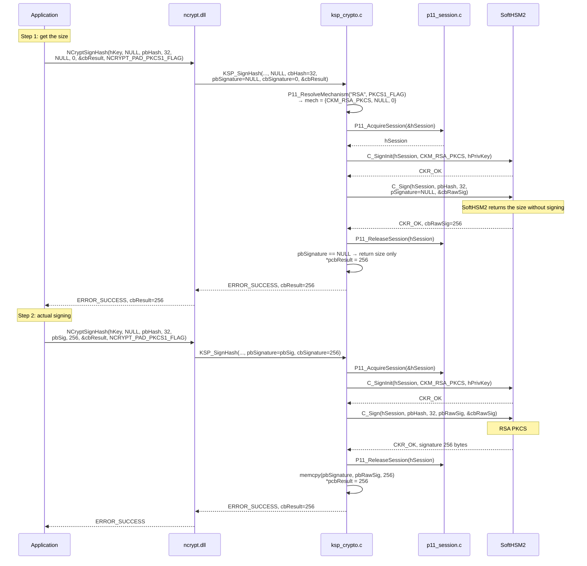
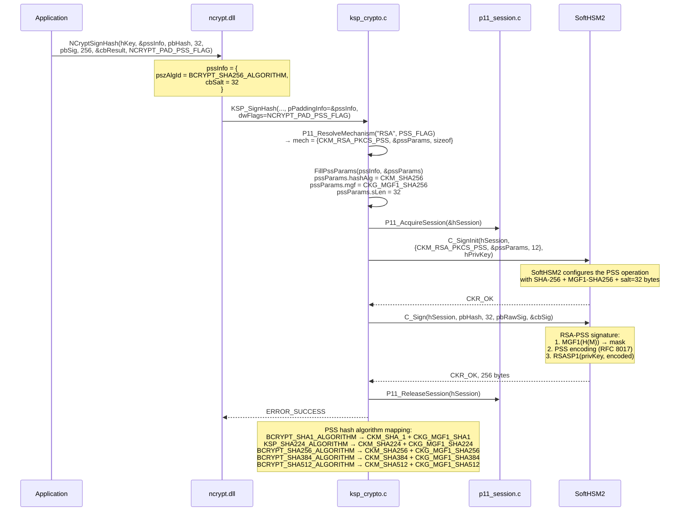
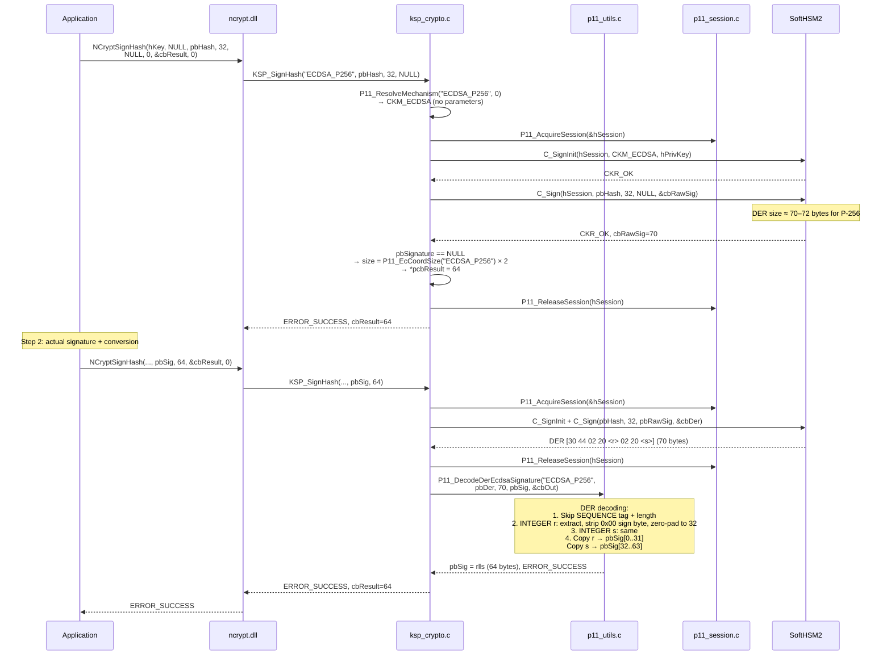
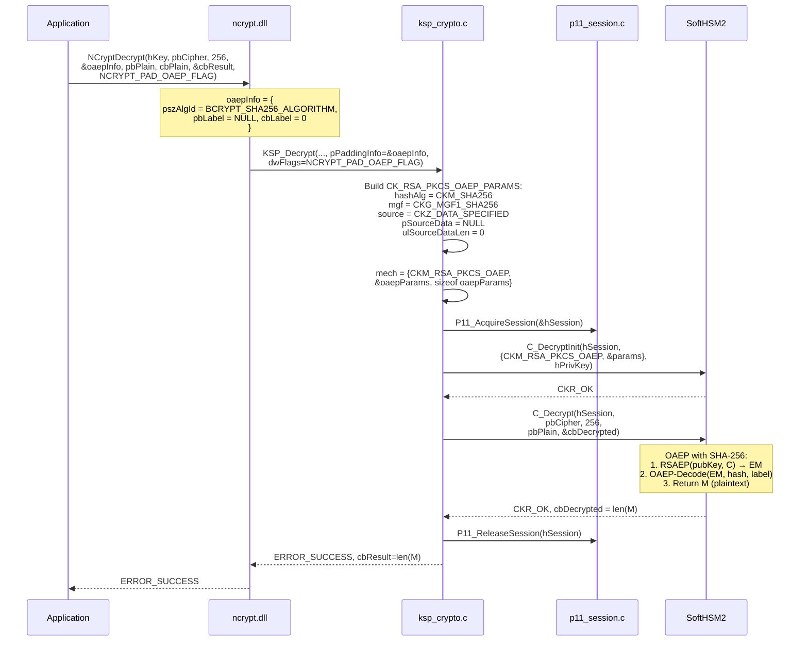
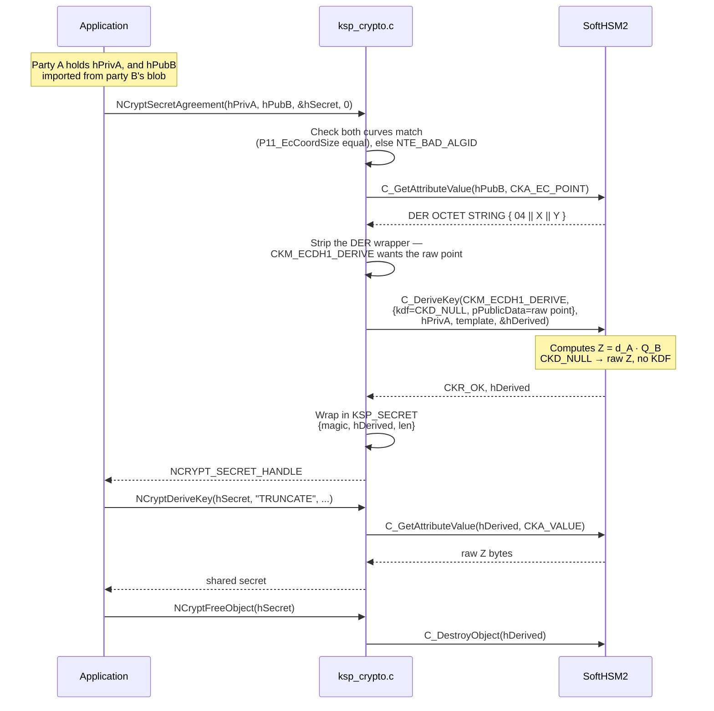
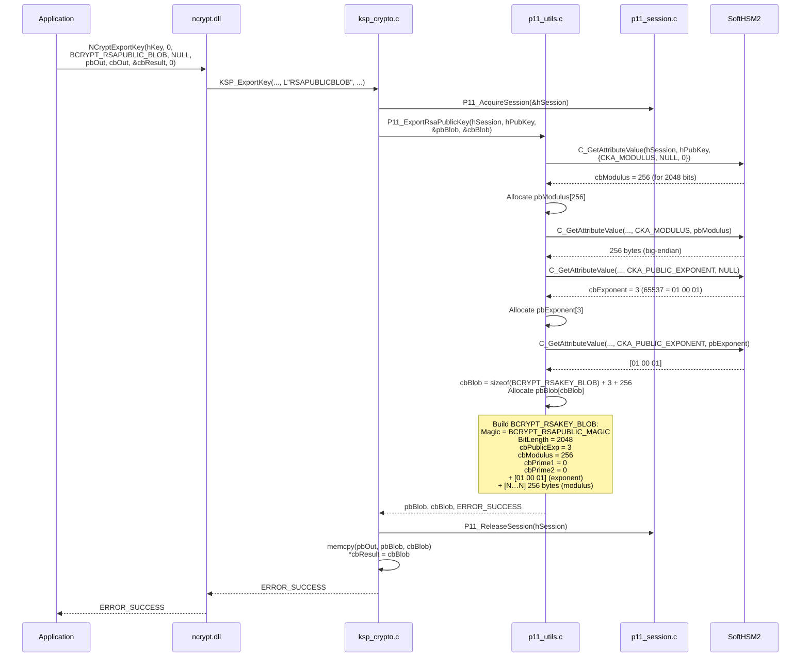
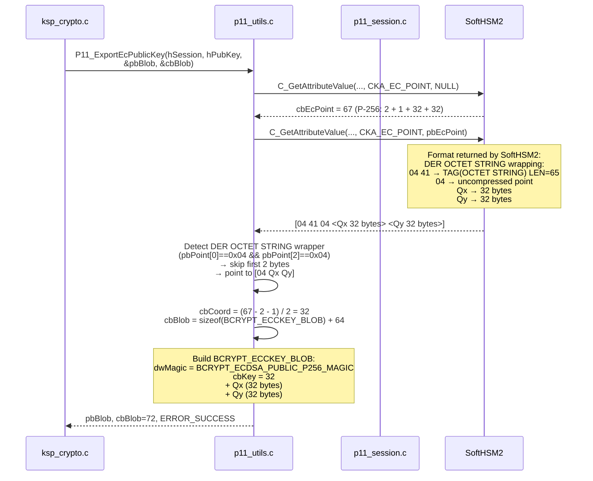
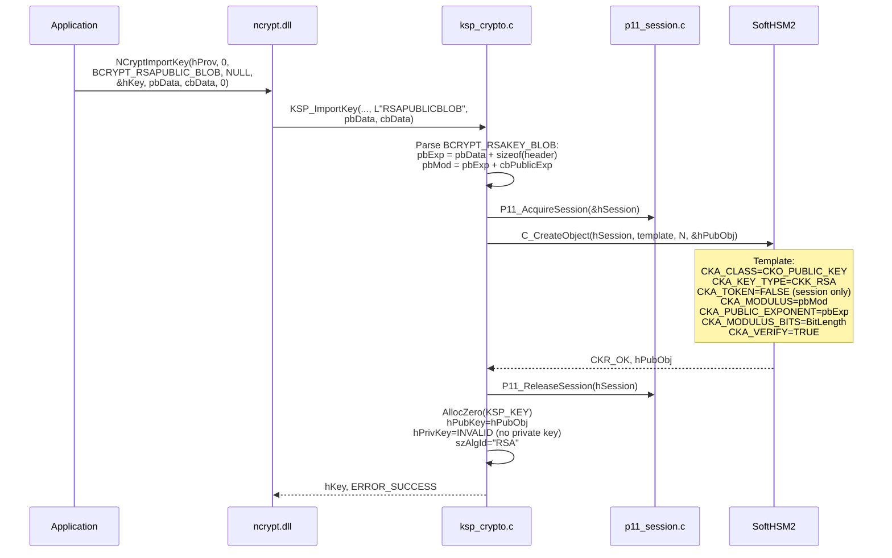

# Cryptographic operations — CNG → PKCS#11 mapping

## Mechanism mapping overview

| CNG call | Flag / Info | PKCS#11 mechanism | Parameters |
|----------|------------|-------------------|------------|
| `SignHash("RSA")` | `NCRYPT_PAD_PKCS1_FLAG` | `CKM_RSA_PKCS` | none |
| `SignHash("RSA")` | `NCRYPT_PAD_PSS_FLAG` + `BCRYPT_PSS_PADDING_INFO` | `CKM_RSA_PKCS_PSS` | `CK_RSA_PKCS_PSS_PARAMS` |
| `SignHash("ECDSA_P256/384/521")` | — | `CKM_ECDSA` | none |
| `SignHash("EDDSA_ED25519/ED448")` | — | `CKM_EDDSA` | none |
| `SignHash("HMAC_SHA1/224/256/384/512")` | — | `CKM_SHA*_HMAC` | none |
| `Decrypt("RSA")` | `NCRYPT_PAD_PKCS1_FLAG` | `CKM_RSA_PKCS` | none |
| `Decrypt("RSA")` | `NCRYPT_PAD_OAEP_FLAG` + `BCRYPT_OAEP_PADDING_INFO` | `CKM_RSA_PKCS_OAEP` | `CK_RSA_PKCS_OAEP_PARAMS` |
| `Encrypt("AES")` / `Decrypt("AES")` | chaining mode key property | `CKM_AES_ECB/CBC/CBC_PAD/CTR/GCM` | IV, `CK_GCM_PARAMS` or `CK_AES_CTR_PARAMS` |
| `SecretAgreement("ECDH_P256/384/521")` | — | `CKM_ECDH1_DERIVE` | `CK_ECDH1_DERIVE_PARAMS` |

Signing dispatch lives in `P11_ResolveMechanism()`; the AES mechanism is
built by `KspBuildAesMechanism()`, which reads the chaining mode and IV from
the key rather than from call flags.

---

## SignHash — RSA PKCS#1 v1.5

### CNG double-call pattern

CNG requires a two-step protocol: the first call with `pbSignature=NULL`
returns the required size, the second performs the actual signing.



---

## SignHash — RSA PSS

### Mapping BCRYPT_PSS_PADDING_INFO → CK_RSA_PKCS_PSS_PARAMS



---

## SignHash — ECDSA (with format conversion)

### Problem: DER format vs Windows format

SoftHSM2 returns the ECDSA signature in **ASN.1 DER** format (SEQUENCE { INTEGER r, INTEGER s }),
but Windows CNG expects the **r‖s** format (raw concatenation, fixed size per curve).

```
DER format (SoftHSM2):              Expected Windows CNG format:
30 44                         ← SEQUENCE                r (32 bytes, big-endian, zero-padded)
  02 20                       ← INTEGER r               s (32 bytes, big-endian, zero-padded)
    <32 bytes of r>           ─────────────────────────────────────────────────
  02 20                       ← INTEGER s               Total: 64 bytes (P-256)
    <32 bytes of s>                                             96 bytes (P-384)
```



### DER → r‖s decoding algorithm

```
Input:  SEQUENCE { INTEGER r, INTEGER s }  (DER format)
Output: r‖s  (fixed size cbCoord×2)

1. Check tag=0x30 (SEQUENCE)
2. Skip the sequence length
3. Read INTEGER r:
   a. Check tag=0x02
   b. Read length cbInt, point pbInt
   c. If pbInt[0] == 0x00 → skip (DER sign byte), cbInt--
   d. If cbInt > cbCoord → error (overflow)
   e. Copy into pbOut[cbCoord - cbInt .. cbCoord - 1]
      (right-aligned, zero-padded on the left)
4. Repeat for INTEGER s → pbOut[cbCoord .. 2*cbCoord - 1]
```

---

## Decrypt — RSA OAEP



### OAEP hash and label mapping

`P11_BuildOaepParams()` fills `CK_RSA_PKCS_OAEP_PARAMS` from the caller's
`BCRYPT_OAEP_PADDING_INFO`. All five SHA-2 family hashes are supported:

| `pszAlgId` | `hashAlg` | `mgf` |
|-----------|-----------|-------|
| `BCRYPT_SHA1_ALGORITHM` | `CKM_SHA_1` | `CKG_MGF1_SHA1` |
| `KSP_SHA224_ALGORITHM` * | `CKM_SHA224` | `CKG_MGF1_SHA224` |
| `BCRYPT_SHA256_ALGORITHM` | `CKM_SHA256` | `CKG_MGF1_SHA256` |
| `BCRYPT_SHA384_ALGORITHM` | `CKM_SHA384` | `CKG_MGF1_SHA384` |
| `BCRYPT_SHA512_ALGORITHM` | `CKM_SHA512` | `CKG_MGF1_SHA512` |

\* `KSP_SHA224_ALGORITHM` (`L"SHA224"`) is this provider's own name. **CNG
defines no SHA-224 algorithm identifier** — Windows has no SHA-224 at all,
so there is no `BCRYPT_SHA224_ALGORITHM` and no standard caller can request
it. Only an application coded against this KSP will reach the SHA-224 rows
in this table and the PSS table above.

Any other name returns `NTE_NOT_SUPPORTED`. A `NULL` padding info, or a
`NULL` `pszAlgId`, defaults to SHA-1 — the CNG legacy behaviour.

When `pbLabel` is non-NULL and `cbLabel` is non-zero, the label is passed
through as `pSourceData` / `ulSourceDataLen`. A zero-length label is treated
as absent. Decryption with a different label than encryption fails, which is
the point of the label.

---

## SignHash — EdDSA (Ed25519 / Ed448)

EdDSA differs from every other signing path in three ways:

1. **No padding parameters.** `CKM_EDDSA` takes no mechanism parameter, and
   padding flags in `dwFlags` are ignored.
2. **No DER conversion.** SoftHSM2 returns the signature already in raw
   form, so `P11_DecodeDerEcdsaSignature()` is not called.
3. **The input is the message, not a digest.** EdDSA hashes internally, so
   what CNG calls the "hash" is passed through unchanged.

| Curve | Signature size | Public key size |
|-------|---------------:|----------------:|
| Ed25519 | 64 bytes | 32 bytes |
| Ed448 | 114 bytes | 57 bytes |

Export uses `BCRYPT_ECDSA_PUBLIC_GENERIC_MAGIC` and a single raw point
after the `BCRYPT_ECCKEY_BLOB` header — there is no X/Y split.

---

## Encrypt / Decrypt — AES

AES follows the CNG symmetric contract: the chaining mode and IV are **key
properties set before the operation**, not call arguments.

```
NCryptSetProperty(hKey, NCRYPT_CHAINING_MODE_PROPERTY, "ChainingModeGCM")
NCryptSetProperty(hKey, NCRYPT_INITIALIZATION_VECTOR, nonce, 12)
NCryptEncrypt(hKey, plaintext, ...)
```

| Chaining mode | PKCS#11 mechanism | IV | Mechanism parameter |
|---------------|-------------------|-----|---------------------|
| `ChainingModeECB` | `CKM_AES_ECB` | none | none |
| `ChainingModeCBC` | `CKM_AES_CBC` | 16 bytes | raw IV bytes |
| `ChainingModeCBC` + `NCRYPT_PAD_CIPHER_FLAG` | `CKM_AES_CBC_PAD` | 16 bytes | raw IV bytes |
| `ChainingModeCTR` | `CKM_AES_CTR` | 16 bytes | `CK_AES_CTR_PARAMS`, 32-bit counter |
| `ChainingModeGCM` | `CKM_AES_GCM` | 12 bytes typical | `CK_GCM_PARAMS`, 128-bit tag |

`ChainingModeCTR` is a KSP extension: CNG defines no standard string for
counter mode. `ChainingModeCCM` and `ChainingModeCFB` return
`NTE_NOT_SUPPORTED` — no SoftHSM2 mechanism is wired to them.

GCM additional authenticated data is supplied through
`NCRYPT_AUTH_TAG_LENGTH` and stored on the key until the operation runs.

> **The IV is consumed by the operation.** Set it again before decrypting
> the ciphertext you just produced, exactly as with BCrypt.

`KSP_Encrypt` rejects asymmetric keys with `NTE_NOT_SUPPORTED`: RSA
encryption is a public-key operation that BCrypt performs on the exported
public key, not something a storage provider does.

---

## SecretAgreement / DeriveKey — ECDH

ECDH is a two-call sequence. `NCryptSecretAgreement` produces an opaque
`NCRYPT_SECRET_HANDLE`; `NCryptDeriveKey` turns it into key material.



| Curve | Shared secret size |
|-------|-------------------:|
| P-256 | 32 bytes |
| P-384 | 48 bytes |
| P-521 | 66 bytes |

Two constraints are enforced before any PKCS#11 call:

- **Both keys must be on the same curve**, or the call returns
  `NTE_BAD_ALGID`. `P11_EcCoordSize()` on each algorithm name is the check.
- **The private key must have a real private object** and the public key a
  real public object, or the call returns `NTE_BAD_KEY`. This is why
  Phase 3's import fix matters: an imported peer key with
  `CK_INVALID_HANDLE` could not be used as an ECDH peer.

### Supported KDFs

`KSP_DeriveKey` implements `BCRYPT_KDF_RAW_SECRET` (`"TRUNCATE"`) only,
returning the raw Z value. A `NULL` KDF name is treated as the raw secret.
Hash-based KDFs return `NTE_NOT_SUPPORTED` — request the raw secret and run
the KDF with BCrypt.

The derived secret object is created with `CKA_EXTRACTABLE=TRUE` and
`CKA_TOKEN=FALSE`: it is a short-lived session object that exists only so
its `CKA_VALUE` can be read back, and `KSP_FreeSecret` destroys it.

---

## ExportKey — RSA public key → BCRYPT_RSAKEY_BLOB



### BCRYPT_RSAKEY_BLOB memory layout

```
Offset  Size    Content
──────  ──────  ──────────────────────────────────────────
0       4       Magic = 0x31415352 ('RSA1' = RSAPUBLIC)
4       4       BitLength = 2048
8       4       cbPublicExp = 3
12      4       cbModulus = 256
16      4       cbPrime1 = 0
20      4       cbPrime2 = 0
24      3       Public exponent [01 00 01]
27      256     Modulus N (big-endian)
```

---

## ExportKey — EC public key → BCRYPT_ECCKEY_BLOB



### BCRYPT_ECCKEY_BLOB memory layout

```
Offset  Size    Content (P-256)
──────  ──────  ──────────────────────────────────────────
0       4       dwMagic = 0x31534345 (ECDSA P-256 public)
4       4       cbKey = 32
8       32      Qx (X coordinate of the public point)
40      32      Qy (Y coordinate of the public point)
```

---

## ImportKey — RSA public key



> **Note:** Private key import returns `NTE_NOT_SUPPORTED`.
> Private keys never leave SoftHSM2 (`CKA_EXTRACTABLE=FALSE`).

---

## ImportKey — EC public key

EC import follows the same shape as RSA but must rebuild `CKA_EC_POINT`
from the blob's X and Y coordinates.

```
BCRYPT_ECCKEY_BLOB { dwMagic, cbKey } || X (cbKey) || Y (cbKey)
           │
           ▼  P11_BuildEcPointDer()
DER OCTET STRING { 0x04 || X || Y }
           │
           ▼  C_CreateObject
CKO_PUBLIC_KEY { CKA_KEY_TYPE=CKK_EC, CKA_EC_PARAMS=<curve OID>,
                 CKA_EC_POINT=<DER>, CKA_VERIFY=TRUE, CKA_DERIVE=TRUE }
```

The curve is identified from `cbKey`: 32 → P-256, 48 → P-384, 66 → P-521.
Any other size returns `NTE_BAD_ALGID`.

`P11_BuildEcPointDer()` selects the DER length form by size. A P-256 point
is 65 bytes and uses the short form (`04 41 04 …`); a P-521 point is 133
bytes and needs the long form (`04 81 85 04 …`). Getting this wrong is the
classic P-521 bug — the same asymmetry appears when *reading*
`CKA_EC_POINT` back in `P11_ExportEcPublicKey`.

Validation before any PKCS#11 call:

| Condition | Result |
|-----------|--------|
| `cbData < sizeof(BCRYPT_ECCKEY_BLOB)` | `NTE_INVALID_PARAMETER` |
| `cbData < header + 2 × cbKey` | `NTE_INVALID_PARAMETER` |
| `cbKey` not 32 / 48 / 66 | `NTE_BAD_ALGID` |

The resulting key is marked `bSessionObject = TRUE`, so `KSP_FreeKey`
destroys the session object instead of leaking it. `CKA_DERIVE=TRUE` is set
so the imported key can serve as an ECDH peer.

---

## Importing raw symmetric key material

`NCryptImportKey` accepts `BCRYPT_KEY_DATA_BLOB` — a
`BCRYPT_KEY_DATA_BLOB_HEADER` followed by `cbKeyData` bytes of key.

| `cbKeyData` | Stored as | Algorithm reported |
|-------------|-----------|--------------------|
| 16, 24, 32 | `CKK_AES` | `AES` |
| anything else | `CKK_GENERIC_SECRET` | `HMAC_SHA256` |

The blob carries no algorithm name, so length is the only signal available.

`cbKeyData` is caller-supplied and is checked against the bytes actually
present before any of them are read; a header magic or version that does
not match returns `NTE_BAD_DATA`, and a length of zero or one larger than
the buffer returns `NTE_INVALID_PARAMETER`.

The imported object is created `CKA_EXTRACTABLE=FALSE`, exactly like every
key this provider generates.

### Export is refused, deliberately

`NCryptExportKey` with `BCRYPT_KEY_DATA_BLOB` returns `NTE_NOT_SUPPORTED`
and logs why. Because the key is not extractable, `C_GetAttributeValue`
would refuse `CKA_VALUE` and the failure would otherwise surface as a
generic PKCS#11 error several layers down.

This is not a gap waiting to be filled. Making export work would mean
creating keys `CKA_EXTRACTABLE=TRUE` — weakening every deployment to
satisfy one blob type. Material goes in; from then on only the token uses
it. Callers that need the bytes back should keep their own copy.

---

## Key derivation (`NCryptDeriveKey`)

| KDF | Status |
|-----|--------|
| `BCRYPT_KDF_RAW_SECRET` (`L"TRUNCATE"`) | Returns the raw Z |
| `BCRYPT_KDF_HASH` (`L"HASH"`) | `Hash(prepend ‖ Z ‖ append)` |
| `BCRYPT_KDF_HKDF` (`L"HKDF"`) | RFC 5869 extract-and-expand |
| `BCRYPT_KDF_HMAC` (`L"HMAC"`) | `HMAC(key, prepend ‖ Z ‖ append)` |
| `BCRYPT_KDF_TLS_PRF` | `NTE_NOT_SUPPORTED` |

### `BCRYPT_KDF_HASH`

Parameters come from the `NCryptBufferDesc`:

| Buffer type | Meaning |
|-------------|---------|
| `KDF_HASH_ALGORITHM` | Hash name. **Absent means SHA-1** — the documented CNG default, not a choice made here |
| `KDF_SECRET_PREPEND` | Bytes hashed before Z |
| `KDF_SECRET_APPEND` | Bytes hashed after Z |

SHA-1, SHA-224\*, SHA-256, SHA-384 and SHA-512 are accepted; any other name
returns `NTE_BAD_ALGID`. Several `PREPEND` or `APPEND` buffers may be given
and are concatenated in the order they appear, which the test suite asserts
directly rather than inferring from the output length.

The digest runs on the token via `C_DigestInit` / `C_DigestUpdate` /
`C_DigestFinal`. That is **not** a security boundary — `CKD_NULL` has
already handed the raw Z to the provider — but it keeps the KSP free of its
own crypto implementation and reuses mechanisms SoftHSM2 certainly has.

Output is exactly one digest. A shorter buffer returns
`NTE_BUFFER_TOO_SMALL` with the required size, and derives nothing.

\* SHA-224 uses this provider's own `KSP_SHA224_ALGORITHM`; CNG has no
SHA-224 identifier.

### `BCRYPT_KDF_HKDF`

RFC 5869, in two stages:

```
PRK  = HMAC(salt, Z)                          extract
T(i) = HMAC(PRK, T(i-1) ‖ info ‖ byte(i))     expand
OKM  = T(1) ‖ T(2) ‖ … truncated to the request
```

| Buffer type | Meaning |
|-------------|---------|
| `KDF_HASH_ALGORITHM` | Hash name; SHA-1 when absent |
| `KDF_HKDF_SALT` | Optional. Absent is the RFC's "no salt" case |
| `KDF_HKDF_INFO` | Optional context |

Output may be any length up to 255 × HashLen, as the RFC allows; beyond that
returns `NTE_INVALID_PARAMETER`.

**Why this is more than a longer digest chain.** HKDF is *keyed*, and
PKCS#11 has no "HMAC these bytes with that key" call — the key must be an
object first. Every HMAC here is therefore `C_CreateObject`, `C_SignInit`,
`C_Sign`, `C_DestroyObject`. The destroy runs even when signing fails; a
long expansion that leaked one generic secret per round would fill the
token. The test suite asserts creates and destroys stay equal, and fault
injection confirms it notices when they do not.

### `BCRYPT_KDF_HMAC`

A single `HMAC(key, prepend ‖ Z ‖ append)`. The key comes from a
`KDF_HMAC_KEY` buffer; absent means an empty key, which HMAC's padding
rules make well defined.

CNG also defines `KDF_USE_SECRET_AS_HMAC_KEY_FLAG`, passed in `dwFlags`.
With it set, **Z becomes the key** and leaves the message, so the result is
`HMAC(Z, prepend ‖ append)`. That flag is honoured rather than ignored: the
alternative is silently computing something different from what the caller
asked for, and the two results share no structure.

### What remains

`BCRYPT_KDF_TLS_PRF` needs the TLS 1.0/1.2 dual-hash construction — MD5 and
SHA-1 halves for 1.0, a single PRF for 1.2 — which is a different shape from
either KDF above. Tracked as `ECDH-05`.
