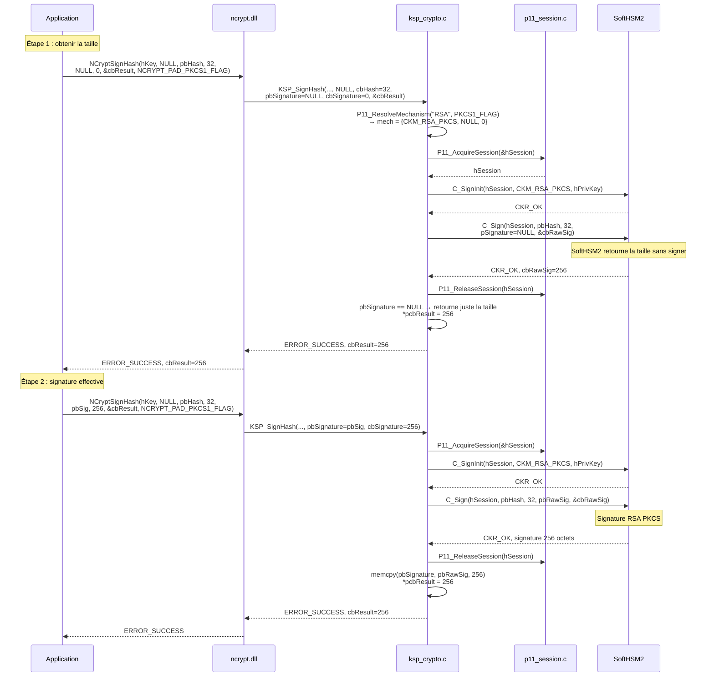
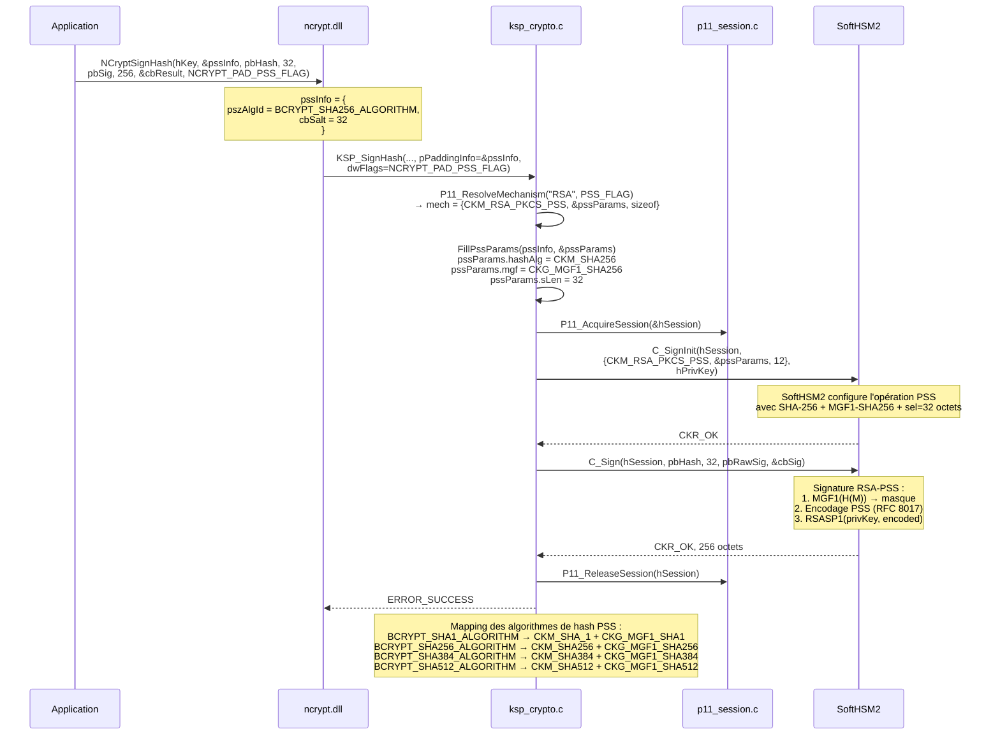
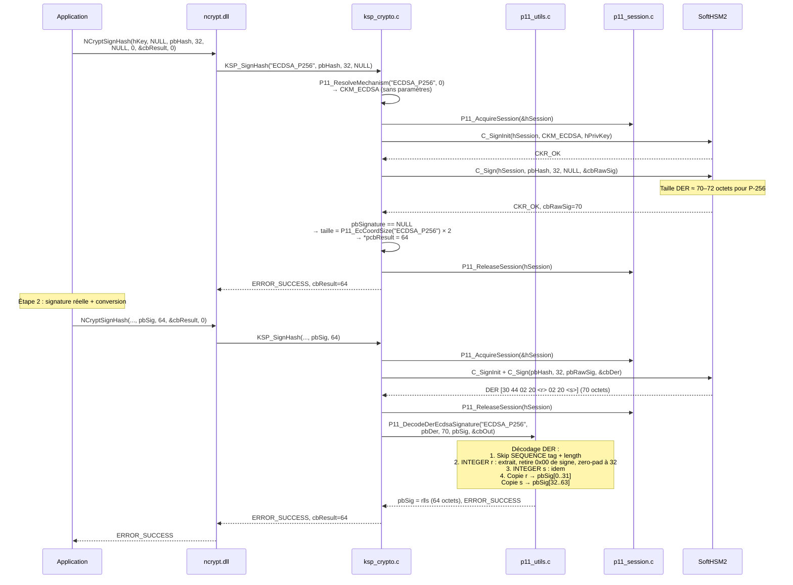
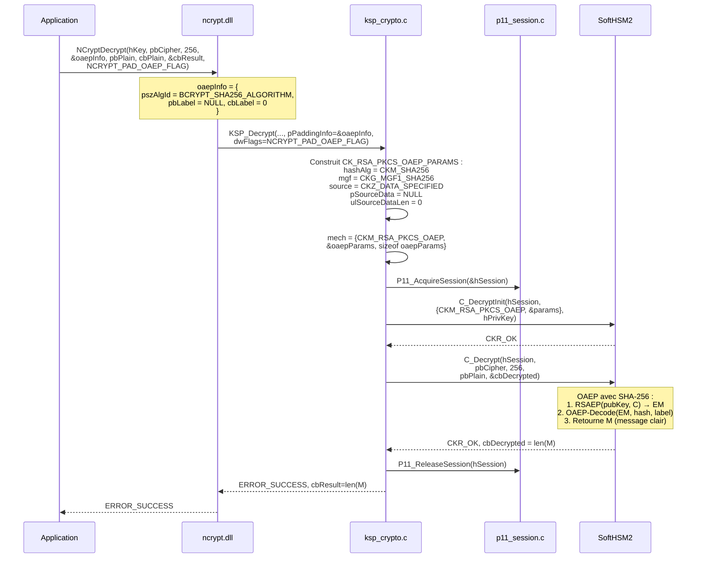
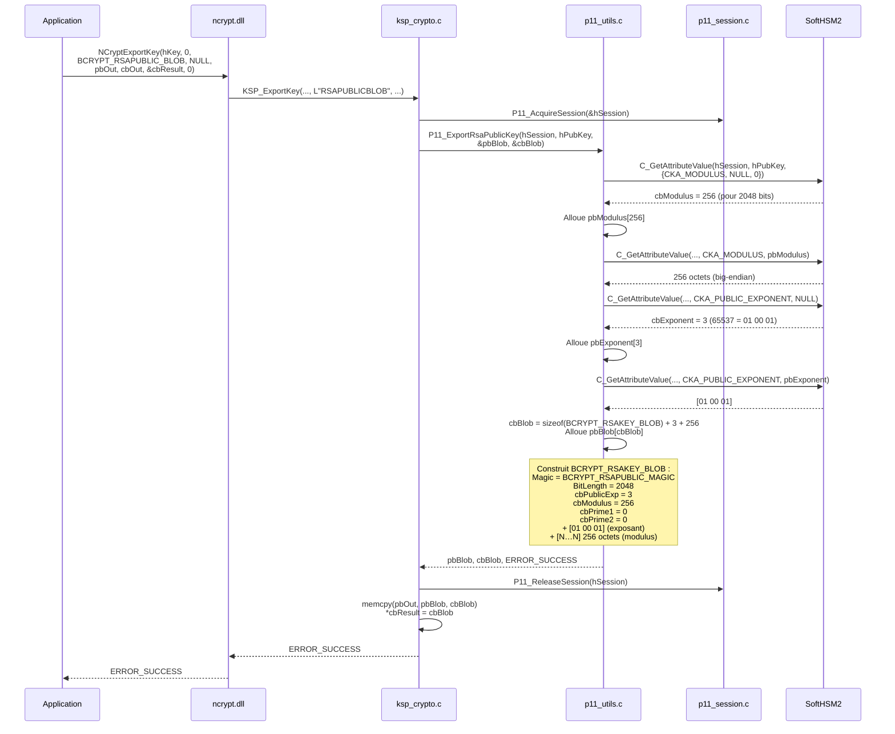
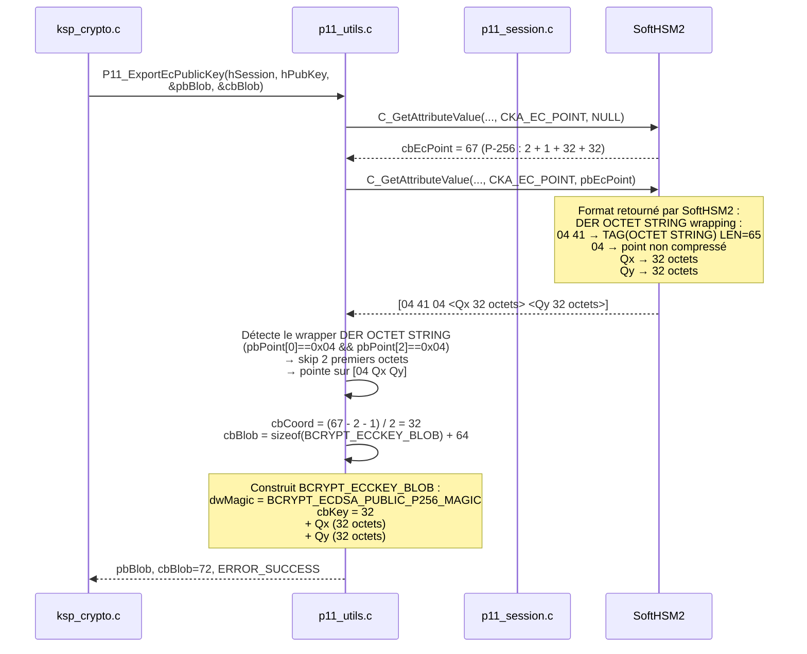
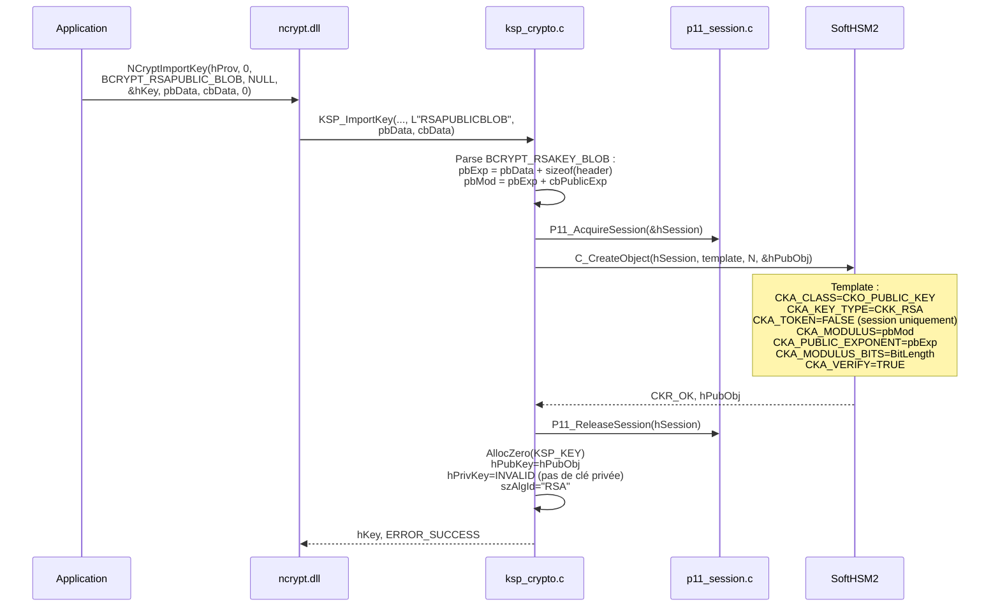

# Opérations cryptographiques — Mapping CNG → PKCS#11

## Vue d'ensemble du mapping des mécanismes

| Appel CNG | Flag / Info | Mécanisme PKCS#11 | Paramètres |
|-----------|------------|-------------------|------------|
| `SignHash("RSA")` | `NCRYPT_PAD_PKCS1_FLAG` | `CKM_RSA_PKCS` | aucun |
| `SignHash("RSA")` | `NCRYPT_PAD_PSS_FLAG` + `BCRYPT_PSS_PADDING_INFO` | `CKM_RSA_PKCS_PSS` | `CK_RSA_PKCS_PSS_PARAMS` |
| `SignHash("ECDSA_P256")` | — | `CKM_ECDSA` | aucun |
| `SignHash("ECDSA_P384")` | — | `CKM_ECDSA` | aucun |
| `Decrypt("RSA")` | `NCRYPT_PAD_PKCS1_FLAG` | `CKM_RSA_PKCS` | aucun |
| `Decrypt("RSA")` | `NCRYPT_PAD_OAEP_FLAG` + `BCRYPT_OAEP_PADDING_INFO` | `CKM_RSA_PKCS_OAEP` | `CK_RSA_PKCS_OAEP_PARAMS` |

---

## SignHash — RSA PKCS#1 v1.5

### Pattern double-appel CNG

CNG impose un protocole en deux étapes : le premier appel avec `pbSignature=NULL`
retourne la taille requise, le second effectue la signature réelle.



---

## SignHash — RSA PSS

### Mapping BCRYPT_PSS_PADDING_INFO → CK_RSA_PKCS_PSS_PARAMS



---

## SignHash — ECDSA (avec conversion de format)

### Problème : format DER vs format Windows

SoftHSM2 retourne la signature ECDSA en **ASN.1 DER** (SEQUENCE { INTEGER r, INTEGER s }),
mais Windows CNG attend le format **r‖s** (concaténation brute, taille fixe selon la courbe).

```
Format DER (SoftHSM2) :       Format Windows CNG (attendu) :
30 44                         ← SEQUENCE                r (32 octets, big-endian, zéro-paddé)
  02 20                       ← INTEGER r               s (32 octets, big-endian, zéro-paddé)
    <32 octets de r>          ─────────────────────────────────────────────────
  02 20                       ← INTEGER s               Total : 64 octets (P-256)
    <32 octets de s>                                            96 octets (P-384)
```



### Algorithme de décodage DER → r‖s

```
Entrée : SEQUENCE { INTEGER r, INTEGER s }  (format DER)
Sortie : r‖s  (taille fixe cbCoord×2)

1. Vérifie tag=0x30 (SEQUENCE)
2. Skip la longueur de la séquence
3. Lit INTEGER r :
   a. Vérifie tag=0x02
   b. Lit longueur cbInt, pointe pbInt
   c. Si pbInt[0] == 0x00 → skip (byte de signe DER), cbInt--
   d. Si cbInt > cbCoord → erreur (dépassement)
   e. Copie dans pbOut[cbCoord - cbInt .. cbCoord - 1]
      (aligné à droite, zero-paddé à gauche)
4. Répète pour INTEGER s → pbOut[cbCoord .. 2*cbCoord - 1]
```

---

## Decrypt — RSA OAEP



---

## ExportKey — Clé publique RSA → BCRYPT_RSAKEY_BLOB



### Structure BCRYPT_RSAKEY_BLOB en mémoire

```
Offset  Taille  Contenu
──────  ──────  ──────────────────────────────────────────
0       4       Magic = 0x31415352 ('RSA1' = RSAPUBLIC)
4       4       BitLength = 2048
8       4       cbPublicExp = 3
12      4       cbModulus = 256
16      4       cbPrime1 = 0
20      4       cbPrime2 = 0
24      3       Exposant public [01 00 01]
27      256     Modulus N (big-endian)
```

---

## ExportKey — Clé publique EC → BCRYPT_ECCKEY_BLOB



### Structure BCRYPT_ECCKEY_BLOB en mémoire

```
Offset  Taille  Contenu (P-256)
──────  ──────  ──────────────────────────────────────────
0       4       dwMagic = 0x31534345 (ECDSA P-256 public)
4       4       cbKey = 32
8       32      Qx (coordonnée X du point public)
40      32      Qy (coordonnée Y du point public)
```

---

## ImportKey — Clé publique RSA



> **Note :** L'import de clés privées retourne `NTE_NOT_SUPPORTED`.
> Les clés privées ne quittent jamais SoftHSM2 (`CKA_EXTRACTABLE=FALSE`).
