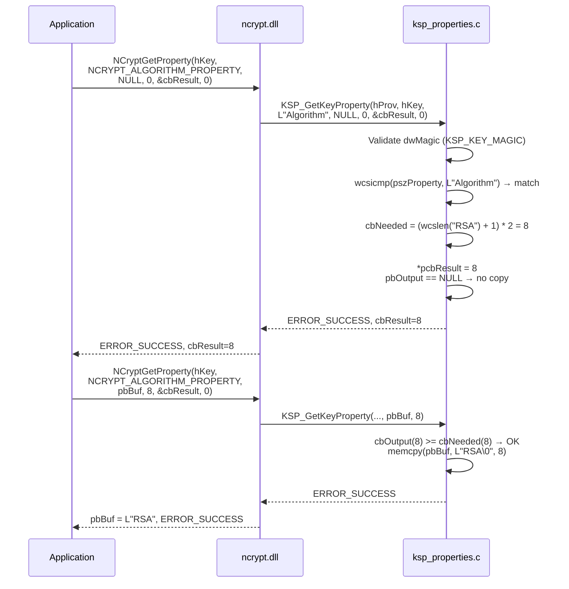
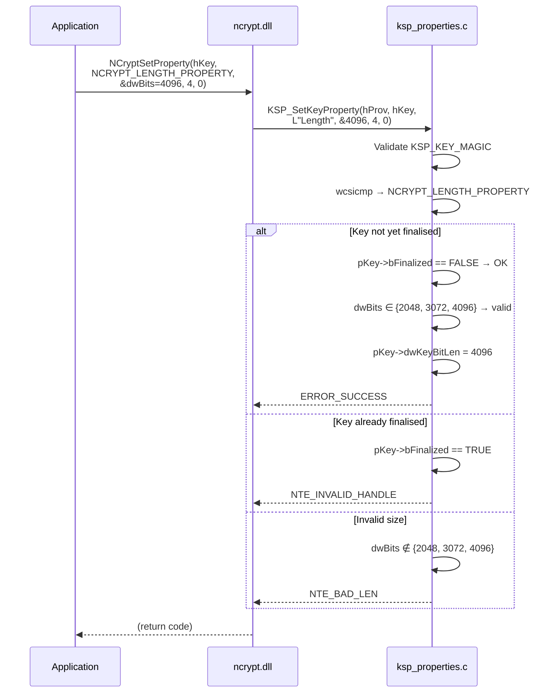

# CNG Properties — Complete mapping

## Provider properties

| CNG property | Returned value | Type | Implemented |
|--------------|----------------|------|-------------|
| `NCRYPT_NAME_PROPERTY` | `L"SoftHSM KSP"` | `WCHAR[]` | ✓ |
| `NCRYPT_VERSION_PROPERTY` | `1` | `DWORD` | ✓ |
| `NCRYPT_IMPL_TYPE_PROPERTY` | `NCRYPT_IMPL_HARDWARE_FLAG` | `DWORD` | ✓ |
| Any other property | — | — | `NTE_NOT_SUPPORTED` |

The `NCRYPT_IMPL_HARDWARE_FLAG` flag tells Windows that this provider behaves
like a hardware HSM (non-exportable keys, enhanced security).

---

## Key properties

### Mapping table

| CNG property | PKCS#11 / KSP_KEY source | Type | Read | Write |
|--------------|--------------------------|------|------|-------|
| `NCRYPT_ALGORITHM_PROPERTY` | `pKey->szAlgId` | `WCHAR[]` | ✓ | ✗ |
| `NCRYPT_LENGTH_PROPERTY` | `pKey->dwKeyBitLen` | `DWORD` | ✓ | ✓ (before FinalizeKey) |
| `NCRYPT_KEY_TYPE_PROPERTY` | `pKey->dwKeySpec` | `DWORD` | ✓ | ✗ |
| `NCRYPT_NAME_PROPERTY` | `pKey->szKeyName` | `WCHAR[]` | ✓ | ✗ |
| `NCRYPT_UNIQUE_NAME_PROPERTY` | `pKey->szKeyName` | `WCHAR[]` | ✓ | ✗ |
| `NCRYPT_EXPORT_POLICY_PROPERTY` | `0` (non-exportable) | `DWORD` | ✓ | ✗ |
| `NCRYPT_KEY_USAGE_PROPERTY` | calculated from algorithm and `dwKeySpec` | `DWORD` | ✓ | ✗ |
| `NCRYPT_ALGORITHM_GROUP_PROPERTY` | calculated from `szAlgId` | `WCHAR[]` | ✓ | ✗ |
| `NCRYPT_CHAINING_MODE_PROPERTY` | `pKey->szChainingMode` | `WCHAR[]` | ✓ symmetric only | ✓ symmetric only |
| `NCRYPT_INITIALIZATION_VECTOR` | `pKey->pbIV` / `cbIV` | `BYTE[]` | ✓ symmetric only | ✓ symmetric only |
| `NCRYPT_AUTH_TAG_LENGTH` | `pKey->pbAuthData` (GCM AAD) | `BYTE[]` | ✗ | ✓ symmetric only |
| `NCRYPT_BLOCK_LENGTH_PROPERTY` | `16` (AES block) | `DWORD` | ✓ AES only | ✗ |
| Any other property | — | — | `NTE_NOT_SUPPORTED` | `NTE_NOT_SUPPORTED` |

Reading or writing a cipher property on an asymmetric key returns
`NTE_NOT_SUPPORTED`, and `NCRYPT_BLOCK_LENGTH_PROPERTY` is rejected on
anything that is not AES — an HMAC key is not a block cipher.

### Computing NCRYPT_ALGORITHM_GROUP_PROPERTY

The group is derived from the algorithm name, not the key spec:

| `szAlgId` | Group |
|-----------|-------|
| `RSA` | `"RSA"` |
| `ECDSA_P256/384/521` | `"ECDSA"` |
| `ECDH_P256/384/521` | `"ECDH"` |
| `EDDSA_ED25519/ED448` | `"EDDSA"` |
| `AES` | `"AES"` |
| `HMAC_SHA1/256/384/512` | `"HMAC"` |

### Computing NCRYPT_KEY_USAGE_PROPERTY

ECDH and AES are special-cased before the `dwKeySpec` fallback:

```
ECDH_*                       → NCRYPT_ALLOW_KEY_AGREEMENT_FLAG (0x00000004)
AES                          → NCRYPT_ALLOW_DECRYPT_FLAG       (0x00000001)
dwKeySpec == AT_SIGNATURE    → NCRYPT_ALLOW_SIGNING_FLAG       (0x00000002)
dwKeySpec == AT_KEYEXCHANGE  → NCRYPT_ALLOW_DECRYPT_FLAG       (0x00000001)
```

### Validating NCRYPT_LENGTH_PROPERTY (write)

Accepted sizes depend on the algorithm family. In every case the write must
happen **before** `FinalizeKey`, or the call returns `NTE_INVALID_HANDLE`.

| Algorithm | Accepted values | Otherwise |
|-----------|-----------------|-----------|
| `RSA` | 2048, 3072, 4096 | `NTE_BAD_LEN` |
| `AES` | 128, 192, 256 | `NTE_BAD_LEN` |
| `HMAC_*` | any multiple of 8 that is ≥ 128 | `NTE_BAD_LEN` |
| EC / EdDSA curves | only the value the curve already implies | `NTE_BAD_LEN` |

Curve sizes are fixed by the algorithm name, so a write is accepted only as
a no-op that restates the existing length.

### Validating NCRYPT_CHAINING_MODE_PROPERTY (write)

| Value | Result |
|-------|--------|
| `ChainingModeECB` | accepted → `CKM_AES_ECB` |
| `ChainingModeCBC` | accepted → `CKM_AES_CBC` (or `CKM_AES_CBC_PAD` with `NCRYPT_PAD_CIPHER_FLAG`) |
| `ChainingModeGCM` | accepted → `CKM_AES_GCM` |
| `ChainingModeCTR` | accepted → `CKM_AES_CTR` (KSP extension) |
| `ChainingModeCCM`, `ChainingModeCFB` | `NTE_NOT_SUPPORTED` |
| On an asymmetric key | `NTE_NOT_SUPPORTED` |

Reading the property back before any write returns `ChainingModeCBC`, the
default the mechanism builder falls through to.

### Validating NCRYPT_INITIALIZATION_VECTOR (write)

```
cbInput == 0                 → NTE_INVALID_PARAMETER
cbInput  > 16 (AES block)    → NTE_INVALID_PARAMETER
Asymmetric key               → NTE_NOT_SUPPORTED
Otherwise                    → stored in pKey->pbIV, cbIV = cbInput
```

GCM normally uses a 12-byte nonce and CBC/CTR a full 16-byte block; the
property accepts anything from 1 to 16 bytes and the mechanism builder
enforces the per-mode requirement at operation time.

---

## Sequence diagram — GetKeyProperty



---

## Sequence diagram — SetKeyProperty (RSA key length)



---

## Unsupported properties

The following properties always return `NTE_NOT_SUPPORTED`:

- `SetProviderProperty` (all)
- `SetKeyProperty` for any property other than `NCRYPT_LENGTH_PROPERTY`
- `GetOperationProperty`
- `PromptUser`
