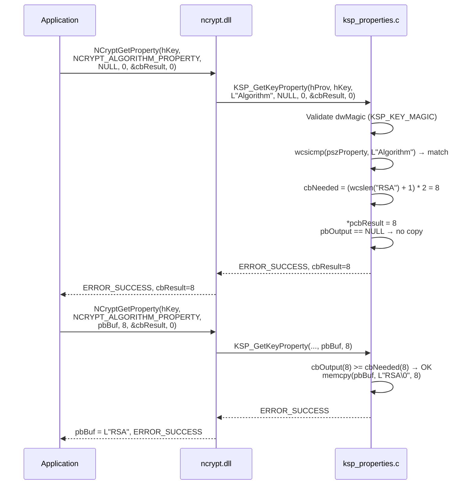
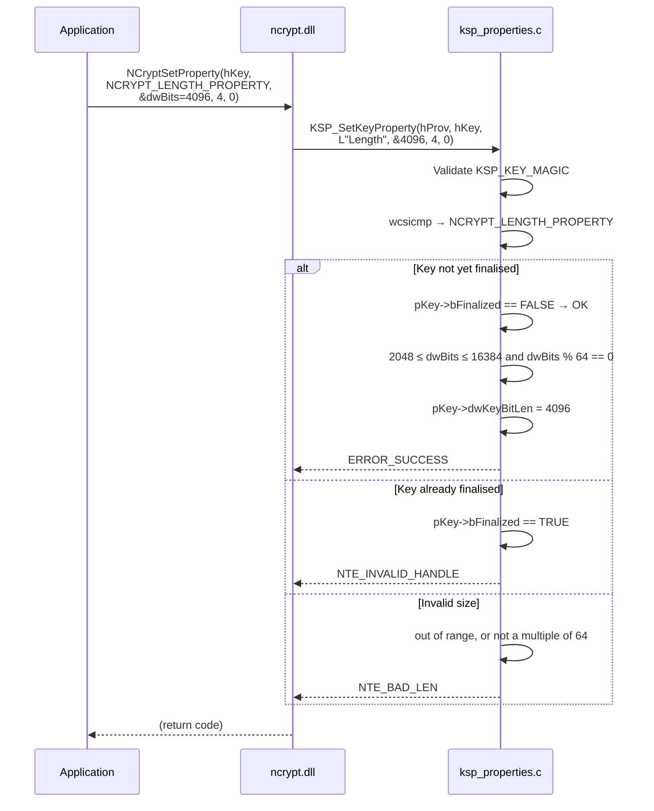

# CNG Properties — Complete mapping

## Provider properties

| CNG property | Returned value | Type | Implemented |
|--------------|----------------|------|-------------|
| `NCRYPT_NAME_PROPERTY` | `L"SoftHSM KSP"` | `WCHAR[]` | ✓ |
| `NCRYPT_VERSION_PROPERTY` | `1` | `DWORD` | ✓ |
| `NCRYPT_IMPL_TYPE_PROPERTY` | `NCRYPT_IMPL_SOFTWARE_FLAG` | `DWORD` | ✓ |
| `"SoftHSM Slot"` | the slot actually selected | `DWORD` | ✓ read; ✓ write until the slot is bound |
| Any other property | — | — | `NTE_NOT_SUPPORTED` |

**`NCRYPT_AUTH_TAG_LENGTH` is read-only, and it never meant AAD.**
Microsoft's definition: *"The authentication tag lengths that are
supported by the algorithm. This property is a
`BCRYPT_AUTH_TAG_LENGTHS_STRUCT` structure. This property only applies to
algorithms."* It reports a range — GCM 12–16 in steps of 1, CCM 4–16 in
steps of 2 — and setting it is refused.

This provider used to treat a *set* of it as "here is my additional
authenticated data" and copy the bytes into the key's AAD buffer. An
application that legitimately wrote a tag length would have had those four
bytes silently become GCM AAD and fail authentication, and AAD had no
correct route at all. It belongs in
`BCRYPT_AUTHENTICATED_CIPHER_MODE_INFO`, passed as `pPaddingInfo` to
`NCryptEncrypt` / `NCryptDecrypt`, which the provider now reads. No test
had ever exercised the property, which is why it survived.

**`NCRYPT_EXPORT_POLICY_PROPERTY` decides whether a key can ever leave.**
Settable only *before* `NCryptFinalizeKey`, because `CKA_SENSITIVE` and
`CKA_EXTRACTABLE` are fixed on the token when the key is generated and
PKCS#11 gives no way to relax them afterwards. Accepting it on a finalized
key would return success and change nothing.

The two flags guard **different** operations and map to **different**
attributes. Collapsing them would hand a caller who asked only for wrapped
export the ability to read the key in the clear:

| Policy | `CKA_EXTRACTABLE` | `CKA_SENSITIVE` | Effect |
|---|---|---|---|
| *(unset — default)* | `FALSE` | `TRUE` | Nothing leaves the token |
| `NCRYPT_ALLOW_EXPORT_FLAG` | `TRUE` | `TRUE` | `C_WrapKey` works; plaintext still refused |
| `NCRYPT_ALLOW_PLAINTEXT_EXPORT_FLAG` | `TRUE` | `FALSE` | `CKA_VALUE` readable, so `BCRYPT_KEY_DATA_BLOB` export works |

`NCRYPT_ALLOW_ARCHIVING_FLAG` and `NCRYPT_ALLOW_PLAINTEXT_ARCHIVING_FLAG`
are about escrowing a copy with a third party — a different feature with a
different threat model. They are refused by name rather than silently
dropped. Unknown bits give `NTE_BAD_FLAGS`.

**The provider does not second-guess the token.** `KSP_ExportKey` asks for
`CKA_VALUE` and passes the token's answer through, so the two cannot
disagree. A key created without the policy gets `CKR_ATTRIBUTE_SENSITIVE`
mapped to its `SECURITY_STATUS`, which tells a caller "sealed key" rather
than "something went wrong".

Building with `-DKSP_ALLOW_EXPORT_POLICY=0` removes the property entirely
and every key stays sealed, whatever the caller asks — the same shape as
`KSP_RSA_MIN_BITS`.

**`BCRYPT_MESSAGE_BLOCK_LENGTH` is the CFB feedback size in bytes.** Unset
reads back as 1, which is CNG's documented default of 8-bit CFB — *not*
the full block. Only 1 and the AES block size are accepted; PKCS#11
defines no mechanism for the sizes in between, and refusing beats
silently selecting a different cipher.

### Provider properties that can be written

| Property | Effect |
|----------|--------|
| `NCRYPT_PIN_PROPERTY` (`L"SmartCardPin"`) | Sets the user PIN for `C_Login`, replacing `SOFTHSM2_PIN`. Sessions open lazily, so a PIN set between `NCryptOpenStorageProvider` and the first cryptographic call is the one used. Sessions already open keep their login — PKCS#11 cannot change credentials on a live session. |
| `"SoftHSM Token Label"` | `CKA_LABEL` of the token to use, until the slot is bound. `NTE_INVALID_HANDLE` after. See below. |
| `"SoftHSM Slot"` | Slot ID to use, on the same terms. |

The PIN is copied into a fixed buffer, zeroed when the session pool is
finalised, and never logged — not even its length. A PIN longer than
`P11_MAX_PIN_LEN` is **rejected rather than truncated**, because a silently
truncated PIN would fail to log in for no visible reason.

**Token selection is writable, until the first operation.**

It used not to be, on the reasoning that the session pool is already bound
to a slot by the time a caller holds a provider handle. That was true of the
old code and it was not a law. The slot is now chosen on the first call that
needs a token, exactly as the PIN has always been, so there is a window
between `NCryptOpenStorageProvider` and the first operation in which the
choice can still be made:

| Property | Type | Selects by |
|----------|------|-----------|
| `"SoftHSM Token Label"` | `WCHAR[]` | `CKA_LABEL` of the token |
| `"SoftHSM Slot"` | `DWORD` | Slot ID |

```c
NCryptOpenStorageProvider(&hProv, L"SoftHSM KSP", 0);
NCryptSetProperty(hProv, L"SoftHSM Token Label",
                  (PBYTE)L"production", 10 * sizeof(WCHAR), 0);
NCryptSetProperty(hProv, NCRYPT_PIN_PROPERTY, ..., 0);
/* the first key operation binds that token */
```

Only one selection is in force: a later call replaces an earlier one rather
than both being consulted in an order the caller cannot see. `cbInput` is a
buffer size, so a label counted with or without its terminator both work —
including at the boundary, where a 32-byte label plus a terminator is 33
characters and a length checked before the terminator is stripped would
refuse something entirely legal. The PIN had the same off-by-one and both
now go through one helper.

**After the window closes it is refused with `NTE_INVALID_HANDLE`, not
accepted.** PKCS#11 cannot move a session between tokens, so a caller told
its selection succeeded would go on using the previous token believing it
had switched — the same shape of defect as `NCryptNotifyChangeKey`
reporting success without writing the event handle it was asked for.

The environment variables still work and remain the right answer for a
deployment rather than an application:

| Variable | Selects by |
|----------|-----------|
| `SOFTHSM2_TOKEN_LABEL` | `CKA_LABEL` of the token — preferred, because SoftHSM2 slot IDs shift when tokens are added or removed |
| `SOFTHSM2_SLOT` | Decimal slot ID |

A selection set through the property outranks both: a property is a
deliberate act by this process, a variable is ambient. If both variables are
set the label wins.

An explicit selection that matches no present token is an **error**, not a
fallback to slot 0 — falling back would sign with the wrong key and look
like it worked. Because a failed selection binds nothing, it can be
corrected in the same process and the next operation succeeds. With nothing
set at all, the first slot reporting a token is used, which is the
historical behaviour.

Read `"SoftHSM Slot"` back to confirm which token was chosen.

**With per-scope tokens configured, a single selection cannot be honoured
and is refused.** `KSP_MACHINE_TOKEN_LABEL` / `KSP_USER_TOKEN_LABEL` name
two tokens and let the key's scope choose between them (see
`03-key-management.md`); a property naming one token contradicts that, so
the first operation fails rather than quietly letting the configuration win.

**How this is tested.** Against **two real tokens**, in
`tests/linux/test_two_tokens.c`, with different labels, different PINs and
different keys on each. One token cannot test selection at all: every
selection "succeeds" by landing on the slot the default would have chosen
anyway, so the assertions would pass whether the provider read the caller's
choice or discarded it.

SoftHSM2 keeps keys in an encrypted SQLite file, so the provider reports
`NCRYPT_IMPL_SOFTWARE_FLAG` rather than claiming hardware backing.

The emitted value did not change when this was corrected: the project's mock
had defined `NCRYPT_IMPL_HARDWARE_FLAG` as `0x2`, which is in fact
`NCRYPT_IMPL_SOFTWARE_FLAG`. The provider had always been reporting software
while the source said hardware. Only the name is now truthful.

Keys remain non-exportable regardless — that is enforced by
`CKA_EXTRACTABLE=FALSE` on the token, not by this flag.

---

## Key properties

### Mapping table

| CNG property | PKCS#11 / KSP_KEY source | Type | Read | Write |
|--------------|--------------------------|------|------|-------|
| `NCRYPT_ALGORITHM_PROPERTY` | `pKey->szAlgId` | `WCHAR[]` | ✓ | ✗ |
| `NCRYPT_LENGTH_PROPERTY` | `pKey->dwKeyBitLen` | `DWORD` | ✓ | ✓ (before FinalizeKey) |
| `NCRYPT_KEY_TYPE_PROPERTY` | `pKey->dwKeySpec` | `DWORD` | ✓ | ✗ |
| `NCRYPT_NAME_PROPERTY` | `pKey->szKeyName` | `WCHAR[]` | ✓ | ✗ |
| `NCRYPT_UNIQUE_NAME_PROPERTY` | `pKey->szKeyName` | `WCHAR[]` | ✓ | ✗ |
| `NCRYPT_EXPORT_POLICY_PROPERTY` | `0` (non-exportable) | `DWORD` | ✓ | ✗ |
| `NCRYPT_KEY_USAGE_PROPERTY` | calculated from algorithm and `dwKeySpec` | `DWORD` | ✓ | ✗ |
| `NCRYPT_ALGORITHM_GROUP_PROPERTY` | calculated from `szAlgId` | `WCHAR[]` | ✓ | ✗ |
| `NCRYPT_CHAINING_MODE_PROPERTY` | `pKey->szChainingMode` | `WCHAR[]` | ✓ symmetric only | ✓ symmetric only |
| `NCRYPT_INITIALIZATION_VECTOR` | `pKey->pbIV` / `cbIV` | `BYTE[]` | ✓ symmetric only | ✓ symmetric only |
| `NCRYPT_AUTH_TAG_LENGTH` | supported tag range | `BCRYPT_AUTH_TAG_LENGTHS_STRUCT` | ✓ GCM/CCM keys | ✗ read-only — see below |
| `BCRYPT_MESSAGE_BLOCK_LENGTH` | `pKey->cbMessageBlockLen` | `DWORD` | ✓ | ✓ symmetric only |
| `NCRYPT_BLOCK_LENGTH_PROPERTY` | `16` (AES block) | `DWORD` | ✓ AES only | ✗ |
| `"SoftHSM Slot"` | the slot actually selected | `DWORD` | ✓ read; ✓ write until the slot is bound |
| Any other property | — | — | `NTE_NOT_SUPPORTED` |

**`NCRYPT_AUTH_TAG_LENGTH` is read-only, and it never meant AAD.**
Microsoft's definition: *"The authentication tag lengths that are
supported by the algorithm. This property is a
`BCRYPT_AUTH_TAG_LENGTHS_STRUCT` structure. This property only applies to
algorithms."* It reports a range — GCM 12–16 in steps of 1, CCM 4–16 in
steps of 2 — and setting it is refused.

This provider used to treat a *set* of it as "here is my additional
authenticated data" and copy the bytes into the key's AAD buffer. An
application that legitimately wrote a tag length would have had those four
bytes silently become GCM AAD and fail authentication, and AAD had no
correct route at all. It belongs in
`BCRYPT_AUTHENTICATED_CIPHER_MODE_INFO`, passed as `pPaddingInfo` to
`NCryptEncrypt` / `NCryptDecrypt`, which the provider now reads. No test
had ever exercised the property, which is why it survived.

**`NCRYPT_EXPORT_POLICY_PROPERTY` decides whether a key can ever leave.**
Settable only *before* `NCryptFinalizeKey`, because `CKA_SENSITIVE` and
`CKA_EXTRACTABLE` are fixed on the token when the key is generated and
PKCS#11 gives no way to relax them afterwards. Accepting it on a finalized
key would return success and change nothing.

The two flags guard **different** operations and map to **different**
attributes. Collapsing them would hand a caller who asked only for wrapped
export the ability to read the key in the clear:

| Policy | `CKA_EXTRACTABLE` | `CKA_SENSITIVE` | Effect |
|---|---|---|---|
| *(unset — default)* | `FALSE` | `TRUE` | Nothing leaves the token |
| `NCRYPT_ALLOW_EXPORT_FLAG` | `TRUE` | `TRUE` | `C_WrapKey` works; plaintext still refused |
| `NCRYPT_ALLOW_PLAINTEXT_EXPORT_FLAG` | `TRUE` | `FALSE` | `CKA_VALUE` readable, so `BCRYPT_KEY_DATA_BLOB` export works |

`NCRYPT_ALLOW_ARCHIVING_FLAG` and `NCRYPT_ALLOW_PLAINTEXT_ARCHIVING_FLAG`
are about escrowing a copy with a third party — a different feature with a
different threat model. They are refused by name rather than silently
dropped. Unknown bits give `NTE_BAD_FLAGS`.

**The provider does not second-guess the token.** `KSP_ExportKey` asks for
`CKA_VALUE` and passes the token's answer through, so the two cannot
disagree. A key created without the policy gets `CKR_ATTRIBUTE_SENSITIVE`
mapped to its `SECURITY_STATUS`, which tells a caller "sealed key" rather
than "something went wrong".

Building with `-DKSP_ALLOW_EXPORT_POLICY=0` removes the property entirely
and every key stays sealed, whatever the caller asks — the same shape as
`KSP_RSA_MIN_BITS`.

**`BCRYPT_MESSAGE_BLOCK_LENGTH` is the CFB feedback size in bytes.** Unset
reads back as 1, which is CNG's documented default of 8-bit CFB — *not*
the full block. Only 1 and the AES block size are accepted; PKCS#11
defines no mechanism for the sizes in between, and refusing beats
silently selecting a different cipher.


Reading or writing a cipher property on an asymmetric key returns
`NTE_NOT_SUPPORTED`, and `NCRYPT_BLOCK_LENGTH_PROPERTY` is rejected on
anything that is not AES — an HMAC key is not a block cipher.

### Computing NCRYPT_ALGORITHM_GROUP_PROPERTY

The group is derived from the algorithm name, not the key spec:

| `szAlgId` | Group |
|-----------|-------|
| `RSA` | `"RSA"` |
| `ECDSA_P256/384/521` | `"ECDSA"` |
| `ECDH_P256/384/521` | `"ECDH"` |
| `EDDSA_ED25519/ED448` | `"EDDSA"` |
| `AES` | `"AES"` |
| `HMAC_SHA1/256/384/512` | `"HMAC"` |

### Computing NCRYPT_KEY_USAGE_PROPERTY

ECDH and AES are special-cased before the `dwKeySpec` fallback:

```
ECDH_*                       → NCRYPT_ALLOW_KEY_AGREEMENT_FLAG (0x00000004)
AES                          → NCRYPT_ALLOW_DECRYPT_FLAG       (0x00000001)
dwKeySpec == AT_SIGNATURE    → NCRYPT_ALLOW_SIGNING_FLAG       (0x00000002)
dwKeySpec == AT_KEYEXCHANGE  → NCRYPT_ALLOW_DECRYPT_FLAG       (0x00000001)
```

### Validating NCRYPT_LENGTH_PROPERTY (write)

Accepted sizes depend on the algorithm family. In every case the write must
happen **before** `FinalizeKey`, or the call returns `NTE_INVALID_HANDLE`.

| Algorithm | Accepted values | Otherwise |
|-----------|-----------------|-----------|
| `RSA` | any multiple of 64 in `[KSP_RSA_MIN_BITS, 16384]` (default lower bound 2048) | `NTE_BAD_LEN` |
| `AES` | 128, 192, 256 | `NTE_BAD_LEN` |
| `HMAC_*` | any multiple of 8 that is ≥ 128 | `NTE_BAD_LEN` |
| EC / EdDSA curves | only the value the curve already implies | `NTE_BAD_LEN` |

Curve sizes are fixed by the algorithm name, so a write is accepted only as
a no-op that restates the existing length.

### RSA public exponent

`NCRYPT_LENGTH_PROPERTY` fixes the modulus size; the public exponent is
carried by the provider-specific property `"RSA Public Exponent"`
(`KSP_PUBLIC_EXPONENT_PROPERTY`), read and written as a little-endian
`DWORD`. CNG defines no standard property for this, so the name is ours and
only an application coded against this KSP will set it.

| Aspect | Behaviour |
|--------|-----------|
| Default | 65537 (F4), so callers that never touch the property are unaffected |
| Accepted values | odd and ≥ 3 |
| Even value, or < 3 | `NTE_INVALID_PARAMETER` |
| Non-RSA key | `NTE_NOT_SUPPORTED` |
| After `FinalizeKey` | `NTE_INVALID_HANDLE` |
| Buffer smaller than 4 bytes | `NTE_INVALID_PARAMETER` |

At `FinalizeKey`, `KSP_EncodePublicExponent` converts the `DWORD` to the
big-endian, minimal-length byte string that `CKA_PUBLIC_EXPONENT` requires —
65537 becomes the three bytes `01 00 01`, and 3 becomes the single byte `03`.

Small exponents such as 3 are accepted because PKCS#11 allows them, not
because they are advisable; padding schemes, not the exponent, are what make
low-exponent RSA safe, so leave this at F4 unless a specific peer requires
otherwise.

### Validating NCRYPT_CHAINING_MODE_PROPERTY (write)

| Value | Result |
|-------|--------|
| `ChainingModeECB` | accepted → `CKM_AES_ECB` |
| `ChainingModeCBC` | accepted → `CKM_AES_CBC` (or `CKM_AES_CBC_PAD` with `NCRYPT_PAD_CIPHER_FLAG`) |
| `ChainingModeGCM` | accepted → `CKM_AES_GCM` |
| `ChainingModeCTR` | accepted → `CKM_AES_CTR` (KSP extension) |
| `ChainingModeCCM`, `ChainingModeCFB` | `NTE_NOT_SUPPORTED` |
| On an asymmetric key | `NTE_NOT_SUPPORTED` |

Reading the property back before any write returns `ChainingModeCBC`, the
default the mechanism builder falls through to.

### Validating NCRYPT_INITIALIZATION_VECTOR (write)

```
cbInput == 0                 → NTE_INVALID_PARAMETER
cbInput  > 16 (AES block)    → NTE_INVALID_PARAMETER
Asymmetric key               → NTE_NOT_SUPPORTED
Otherwise                    → stored in pKey->pbIV, cbIV = cbInput
```

GCM normally uses a 12-byte nonce and CBC/CTR a full 16-byte block; the
property accepts anything from 1 to 16 bytes and the mechanism builder
enforces the per-mode requirement at operation time.

---

## Sequence diagram — GetKeyProperty


```mermaid
sequenceDiagram
    participant App as Application
    participant NCrypt as ncrypt.dll
    participant KSP as ksp_properties.c

    App->>NCrypt: NCryptGetProperty(hKey,<br/>NCRYPT_ALGORITHM_PROPERTY,<br/>NULL, 0, &cbResult, 0)
    NCrypt->>KSP: KSP_GetKeyProperty(hProv, hKey,<br/>L"Algorithm", NULL, 0, &cbResult, 0)

    KSP->>KSP: Validate dwMagic (KSP_KEY_MAGIC)
    KSP->>KSP: wcsicmp(pszProperty, L"Algorithm") → match
    KSP->>KSP: cbNeeded = (wcslen("RSA") + 1) * 2 = 8
    KSP->>KSP: *pcbResult = 8<br/>pbOutput == NULL → no copy

    KSP-->>NCrypt: ERROR_SUCCESS, cbResult=8
    NCrypt-->>App: ERROR_SUCCESS, cbResult=8

    App->>NCrypt: NCryptGetProperty(hKey,<br/>NCRYPT_ALGORITHM_PROPERTY,<br/>pbBuf, 8, &cbResult, 0)
    NCrypt->>KSP: KSP_GetKeyProperty(..., pbBuf, 8)

    KSP->>KSP: cbOutput(8) >= cbNeeded(8) → OK<br/>memcpy(pbBuf, L"RSA\0", 8)

    KSP-->>NCrypt: ERROR_SUCCESS
    NCrypt-->>App: pbBuf = L"RSA", ERROR_SUCCESS
```

---

## Sequence diagram — SetKeyProperty (RSA key length)


```mermaid
sequenceDiagram
    participant App as Application
    participant NCrypt as ncrypt.dll
    participant KSP as ksp_properties.c

    App->>NCrypt: NCryptSetProperty(hKey,<br/>NCRYPT_LENGTH_PROPERTY,<br/>&dwBits=4096, 4, 0)
    NCrypt->>KSP: KSP_SetKeyProperty(hProv, hKey,<br/>L"Length", &4096, 4, 0)

    KSP->>KSP: Validate KSP_KEY_MAGIC
    KSP->>KSP: wcsicmp → NCRYPT_LENGTH_PROPERTY

    alt Key not yet finalised
        KSP->>KSP: pKey->bFinalized == FALSE → OK
        KSP->>KSP: 2048 ≤ dwBits ≤ 16384 and dwBits % 64 == 0
        KSP->>KSP: pKey->dwKeyBitLen = 4096
        KSP-->>NCrypt: ERROR_SUCCESS
    else Key already finalised
        KSP->>KSP: pKey->bFinalized == TRUE
        KSP-->>NCrypt: NTE_INVALID_HANDLE
    else Invalid size
        KSP->>KSP: out of range, or not a multiple of 64
        KSP-->>NCrypt: NTE_BAD_LEN
    end

    NCrypt-->>App: (return code)
```

---

## Unsupported properties

The following properties always return `NTE_NOT_SUPPORTED`:

- `SetProviderProperty` (all)
- `SetKeyProperty` for any property other than `NCRYPT_LENGTH_PROPERTY`
- `PromptUser`

`VerifySignature` used to be on this list. It is implemented now, over
`C_Verify`: `ncrypt.dll` calls the slot for `NCryptVerifySignature`, and a
caller holding only a key handle should not have to export anything to
check a signature. Verifying in software with `BCryptVerifySignature`
against an exported public key is still cheaper and still available — it
is a choice the caller makes, not one the provider makes for them.

`NotifyChangeKey` is refused rather than granted. Its second parameter is
an `[in, out] HANDLE *phEvent` that the caller waits on; this provider
returned `ERROR_SUCCESS` without writing it, so an application that
registered for notification waited on an uninitialised handle. A PKCS#11
token has no key-change channel to register on.
