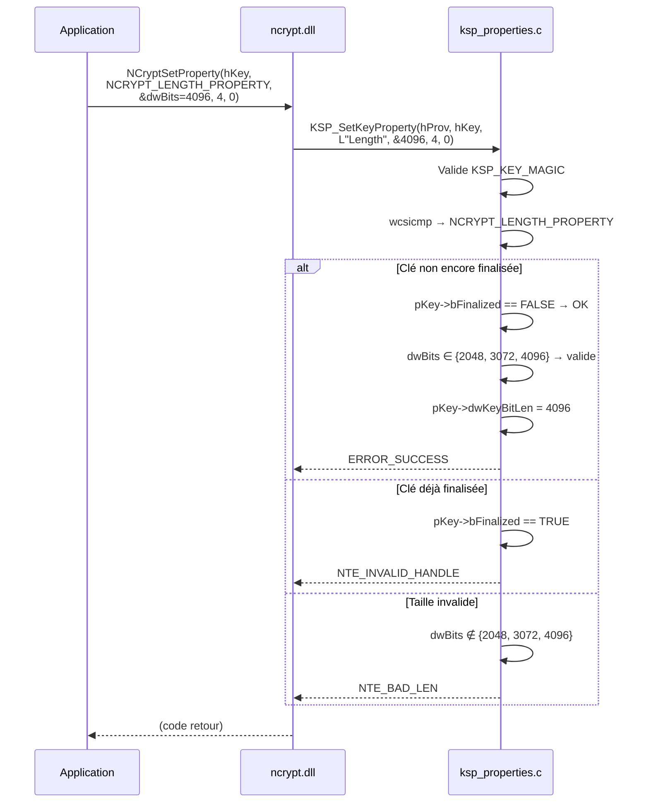

# Propriétés CNG — Mapping complet

## Propriétés du fournisseur (Provider)

| Propriété CNG | Valeur retournée | Type | Implémenté |
|---------------|-----------------|------|-----------|
| `NCRYPT_NAME_PROPERTY` | `L"SoftHSM KSP"` | `WCHAR[]` | ✓ |
| `NCRYPT_VERSION_PROPERTY` | `1` | `DWORD` | ✓ |
| `NCRYPT_IMPL_TYPE_PROPERTY` | `NCRYPT_IMPL_HARDWARE_FLAG` | `DWORD` | ✓ |
| Toute autre propriété | — | — | `NTE_NOT_SUPPORTED` |

Le flag `NCRYPT_IMPL_HARDWARE_FLAG` indique à Windows que ce fournisseur se comporte
comme un HSM matériel (clés non exportables, sécurité renforcée).

---

## Propriétés des clés (Key)

### Tableau de correspondance

| Propriété CNG | Source PKCS#11 / KSP_KEY | Type | Lecture | Écriture |
|---------------|--------------------------|------|---------|---------|
| `NCRYPT_ALGORITHM_PROPERTY` | `pKey->szAlgId` | `WCHAR[]` | ✓ | ✗ |
| `NCRYPT_LENGTH_PROPERTY` | `pKey->dwKeyBitLen` | `DWORD` | ✓ | ✓ (avant FinalizeKey) |
| `NCRYPT_KEY_TYPE_PROPERTY` | `pKey->dwKeySpec` | `DWORD` | ✓ | ✗ |
| `NCRYPT_NAME_PROPERTY` | `pKey->szKeyName` | `WCHAR[]` | ✓ | ✗ |
| `NCRYPT_UNIQUE_NAME_PROPERTY` | `pKey->szKeyName` | `WCHAR[]` | ✓ | ✗ |
| `NCRYPT_EXPORT_POLICY_PROPERTY` | `0` (non exportable) | `DWORD` | ✓ | ✗ |
| `NCRYPT_KEY_USAGE_PROPERTY` | calculé depuis `dwKeySpec` | `DWORD` | ✓ | ✗ |
| `NCRYPT_ALGORITHM_GROUP_PROPERTY` | `"RSA"` ou `"ECDSA"` | `WCHAR[]` | ✓ | ✗ |
| Toute autre propriété | — | — | `NTE_NOT_SUPPORTED` | `NTE_NOT_SUPPORTED` |

### Calcul de NCRYPT_KEY_USAGE_PROPERTY

```
dwKeySpec == AT_SIGNATURE    → NCRYPT_ALLOW_SIGNING_FLAG  (0x00000002)
dwKeySpec == AT_KEYEXCHANGE  → NCRYPT_ALLOW_DECRYPT_FLAG  (0x00000001)
```

### Validation de NCRYPT_LENGTH_PROPERTY (écriture)

Seules les tailles RSA standard sont acceptées avant `FinalizeKey` :

```
2048, 3072, 4096  → accepté
Autre valeur      → NTE_BAD_LEN
Après FinalizeKey → NTE_INVALID_HANDLE
```

---

## Diagramme de séquence — GetKeyProperty


---

## Diagramme de séquence — SetKeyProperty (longueur RSA)



---

## Propriétés non supportées

Les propriétés suivantes retournent systématiquement `NTE_NOT_SUPPORTED` :

- `SetProviderProperty` (toutes)
- `SetKeyProperty` pour toute propriété autre que `NCRYPT_LENGTH_PROPERTY`
- `GetOperationProperty`
- `PromptUser`
