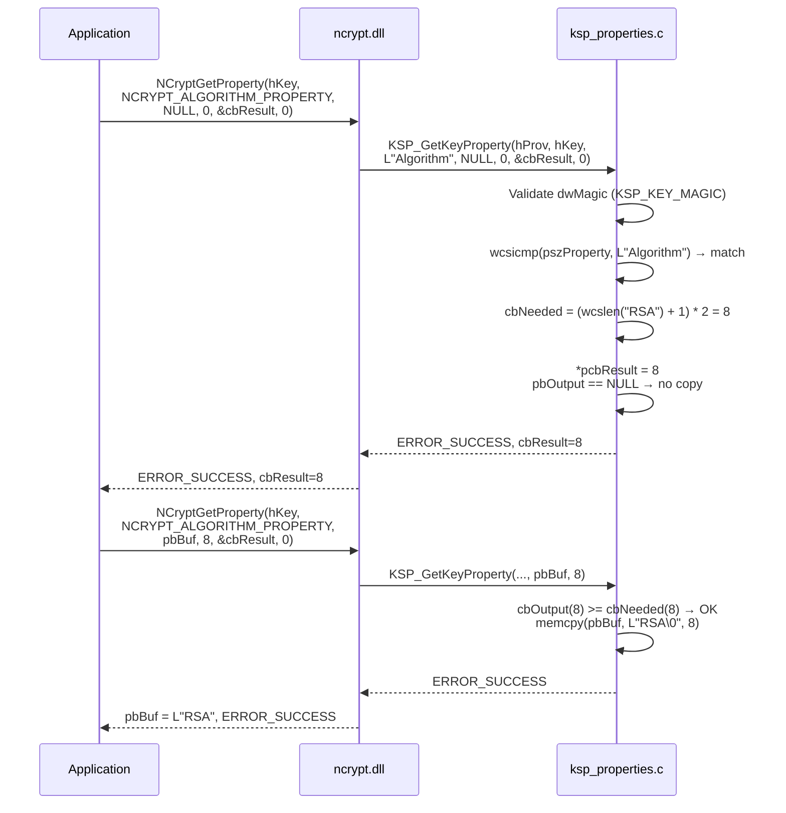
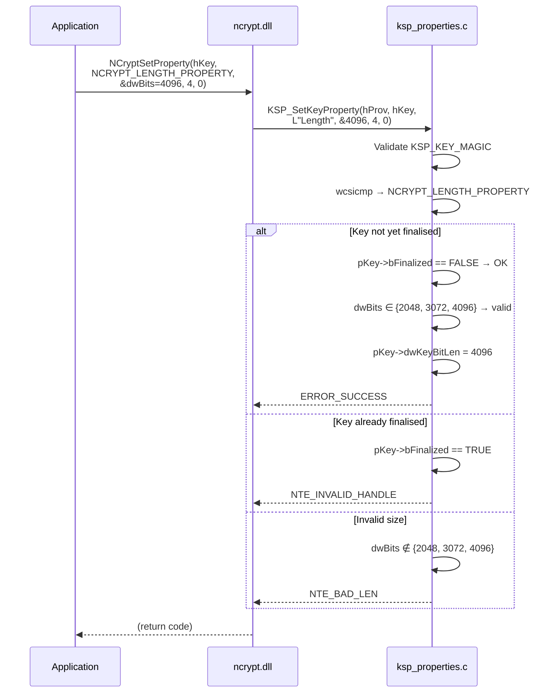

# CNG Properties — Complete mapping

## Provider properties

| CNG property | Returned value | Type | Implemented |
|--------------|----------------|------|-------------|
| `NCRYPT_NAME_PROPERTY` | `L"SoftHSM KSP"` | `WCHAR[]` | ✓ |
| `NCRYPT_VERSION_PROPERTY` | `1` | `DWORD` | ✓ |
| `NCRYPT_IMPL_TYPE_PROPERTY` | `NCRYPT_IMPL_HARDWARE_FLAG` | `DWORD` | ✓ |
| Any other property | — | — | `NTE_NOT_SUPPORTED` |

The `NCRYPT_IMPL_HARDWARE_FLAG` flag tells Windows that this provider behaves
like a hardware HSM (non-exportable keys, enhanced security).

---

## Key properties

### Mapping table

| CNG property | PKCS#11 / KSP_KEY source | Type | Read | Write |
|--------------|--------------------------|------|------|-------|
| `NCRYPT_ALGORITHM_PROPERTY` | `pKey->szAlgId` | `WCHAR[]` | ✓ | ✗ |
| `NCRYPT_LENGTH_PROPERTY` | `pKey->dwKeyBitLen` | `DWORD` | ✓ | ✓ (before FinalizeKey) |
| `NCRYPT_KEY_TYPE_PROPERTY` | `pKey->dwKeySpec` | `DWORD` | ✓ | ✗ |
| `NCRYPT_NAME_PROPERTY` | `pKey->szKeyName` | `WCHAR[]` | ✓ | ✗ |
| `NCRYPT_UNIQUE_NAME_PROPERTY` | `pKey->szKeyName` | `WCHAR[]` | ✓ | ✗ |
| `NCRYPT_EXPORT_POLICY_PROPERTY` | `0` (non-exportable) | `DWORD` | ✓ | ✗ |
| `NCRYPT_KEY_USAGE_PROPERTY` | calculated from `dwKeySpec` | `DWORD` | ✓ | ✗ |
| `NCRYPT_ALGORITHM_GROUP_PROPERTY` | `"RSA"` or `"ECDSA"` | `WCHAR[]` | ✓ | ✗ |
| Any other property | — | — | `NTE_NOT_SUPPORTED` | `NTE_NOT_SUPPORTED` |

### Computing NCRYPT_KEY_USAGE_PROPERTY

```
dwKeySpec == AT_SIGNATURE    → NCRYPT_ALLOW_SIGNING_FLAG  (0x00000002)
dwKeySpec == AT_KEYEXCHANGE  → NCRYPT_ALLOW_DECRYPT_FLAG  (0x00000001)
```

### Validating NCRYPT_LENGTH_PROPERTY (write)

Only standard RSA sizes are accepted before `FinalizeKey`:

```
2048, 3072, 4096  → accepted
Other value       → NTE_BAD_LEN
After FinalizeKey → NTE_INVALID_HANDLE
```

---

## Sequence diagram — GetKeyProperty



---

## Sequence diagram — SetKeyProperty (RSA key length)



---

## Unsupported properties

The following properties always return `NTE_NOT_SUPPORTED`:

- `SetProviderProperty` (all)
- `SetKeyProperty` for any property other than `NCRYPT_LENGTH_PROPERTY`
- `GetOperationProperty`
- `PromptUser`
