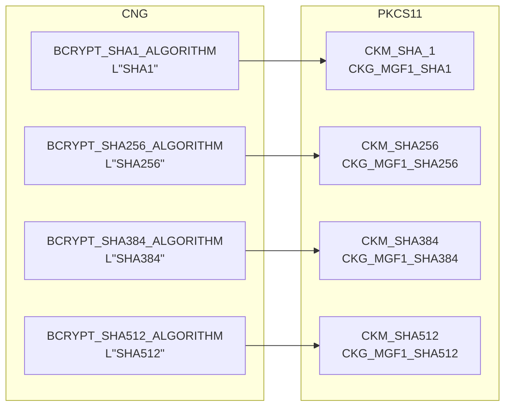
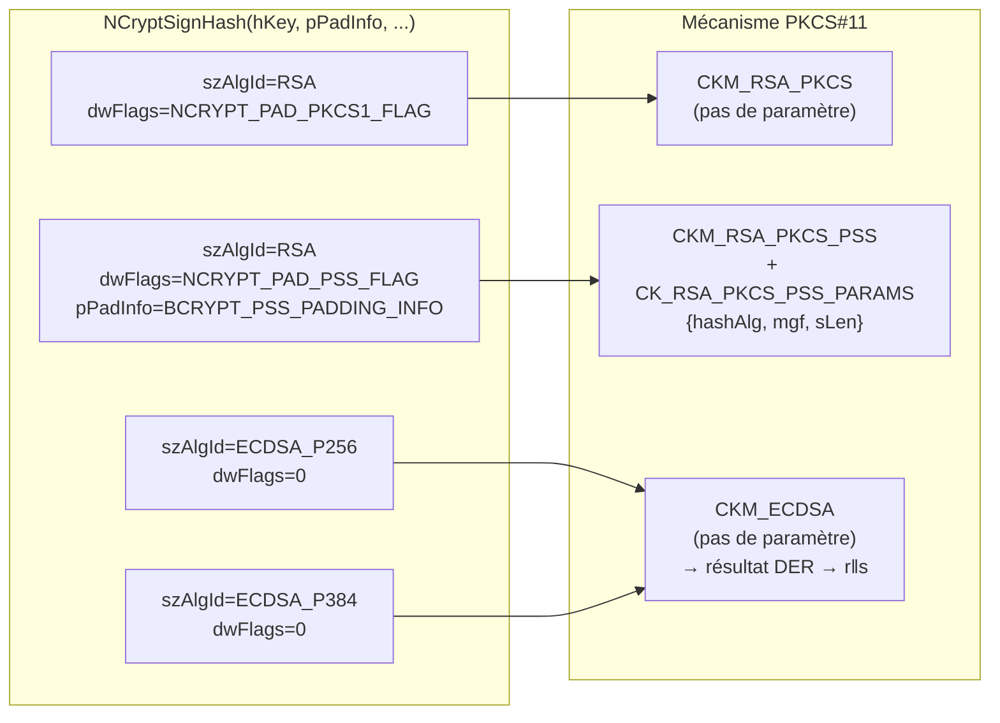
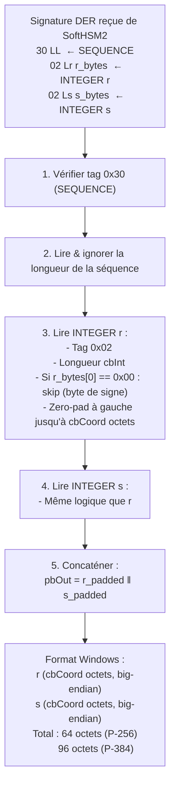
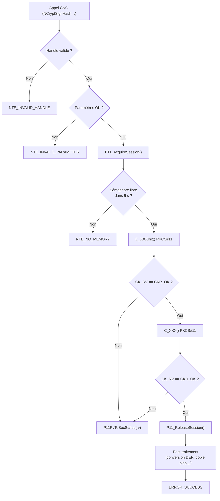

# Mapping d'erreurs et conversions de format

## Conversion CK_RV → SECURITY_STATUS

La fonction `P11RvToSecStatus()` dans `p11_utils.c` effectue ce mapping :

| Code PKCS#11 (`CK_RV`) | Code CNG (`SECURITY_STATUS`) | Signification |
|------------------------|------------------------------|---------------|
| `CKR_OK` | `ERROR_SUCCESS` | Succès |
| `CKR_HOST_MEMORY` | `NTE_NO_MEMORY` | Mémoire insuffisante |
| `CKR_ARGUMENTS_BAD` | `NTE_INVALID_PARAMETER` | Argument invalide |
| `CKR_BUFFER_TOO_SMALL` | `NTE_BUFFER_TOO_SMALL` | Buffer trop petit |
| `CKR_FUNCTION_NOT_SUPPORTED` | `NTE_NOT_SUPPORTED` | Fonctionnalité absente |
| `CKR_KEY_HANDLE_INVALID` | `NTE_BAD_KEY` | Handle de clé invalide |
| `CKR_KEY_SIZE_RANGE` | `NTE_BAD_LEN` | Taille de clé hors limites |
| `CKR_KEY_TYPE_INCONSISTENT` | `NTE_BAD_ALGID` | Type de clé incompatible |
| `CKR_MECHANISM_INVALID` | `NTE_BAD_ALGID` | Mécanisme non supporté |
| `CKR_MECHANISM_PARAM_INVALID` | `NTE_BAD_ALGID` | Paramètres de mécanisme invalides |
| `CKR_OBJECT_HANDLE_INVALID` | `NTE_BAD_KEY` | Handle d'objet invalide |
| `CKR_PIN_INCORRECT` | `NTE_BAD_KEYSET_PARAM` | PIN incorrect |
| `CKR_PIN_LOCKED` | `NTE_BAD_KEYSET_PARAM` | PIN verrouillé (trop d'essais) |
| `CKR_SESSION_HANDLE_INVALID` | `NTE_FAIL` | Handle de session invalide |
| `CKR_SIGNATURE_INVALID` | `NTE_BAD_SIGNATURE` | Signature incorrecte |
| `CKR_SIGNATURE_LEN_RANGE` | `NTE_BAD_LEN` | Longueur de signature invalide |
| `CKR_TOKEN_NOT_PRESENT` | `NTE_NO_KEY` | Token absent ou inaccessible |
| `CKR_USER_NOT_LOGGED_IN` | `NTE_BAD_KEYSET_PARAM` | Utilisateur non connecté |
| `CKR_KEY_UNEXTRACTABLE` | `NTE_NOT_SUPPORTED` | Clé non exportable |
| `CKR_CRYPTOKI_NOT_INITIALIZED` | `NTE_FAIL` | Bibliothèque non initialisée |
| Tout autre code | `NTE_FAIL` | Erreur générique |

---

## Codes de retour par fonction KSP

### KSP_OpenProvider / KSP_FreeProvider

| Condition | Code retour |
|-----------|------------|
| `ppProvider == NULL` | `NTE_INVALID_PARAMETER` |
| `LoadLibrary` échoue | `NTE_PROVIDER_DLL_FAIL` |
| Aucun token SoftHSM2 | `NTE_NO_KEY` |
| Handle invalide (Free) | `NTE_INVALID_HANDLE` |
| Succès | `ERROR_SUCCESS` |

### KSP_CreatePersistedKey

| Condition | Code retour |
|-----------|------------|
| `phKey == NULL` | `NTE_INVALID_PARAMETER` |
| Algorithme inconnu | `NTE_BAD_ALGID` |
| `HeapAlloc` échoue | `NTE_NO_MEMORY` |
| `C_GenerateKeyPair` échoue | `P11RvToSecStatus(rv)` |
| Succès | `ERROR_SUCCESS` |

### KSP_OpenKey

| Condition | Code retour |
|-----------|------------|
| Clé introuvable (label absent) | `NTE_BAD_KEYSET` |
| Session indisponible | `NTE_NO_MEMORY` |
| Succès | `ERROR_SUCCESS` |

### KSP_SignHash

| Condition | Code retour |
|-----------|------------|
| `pbHashValue == NULL` | `NTE_INVALID_PARAMETER` |
| Clé non finalisée | `NTE_KEY_DOES_NOT_EXIST` |
| Algorithme non supporté | `NTE_BAD_ALGID` |
| Buffer signature trop petit | `NTE_BUFFER_TOO_SMALL` |
| `C_SignInit` échoue | `P11RvToSecStatus(rv)` |
| `C_Sign` échoue | `P11RvToSecStatus(rv)` |
| DER invalide (ECDSA) | `NTE_INVALID_PARAMETER` |
| Succès | `ERROR_SUCCESS` |

### KSP_ExportKey

| Condition | Code retour |
|-----------|------------|
| Type blob privé demandé | `NTE_NOT_SUPPORTED` |
| `hPubKey` invalide | `NTE_BAD_KEY` |
| Type blob inconnu | `NTE_NOT_SUPPORTED` |
| Buffer trop petit | `NTE_BUFFER_TOO_SMALL` |
| Succès | `ERROR_SUCCESS` |

---

## Conversion des algorithmes CNG → PKCS#11

### Algorithmes de hash (PSS et OAEP)



### Mécanismes de signature



---

## Conversion de format de signature ECDSA

### Format DER (PKCS#11) → Format Windows CNG



### Exemple concret (P-256, r et s de 31 octets après trim)

```
Entrée DER (70 octets) :
  30 44
    02 1F  ← r sans byte de signe (31 octets significatifs)
      AA BB CC ... (31 octets)
    02 21  ← s avec byte de signe 0x00 (32 + 1 = 33 octets bruts)
      00 DD EE FF ... (1 + 32 octets)

Traitement de r :
  cbInt=31, pas de 0x00 en tête
  pad à gauche : 00 || AA BB CC ... (32 octets)
  → pbOut[0..31] = 00 AA BB CC ...

Traitement de s :
  cbInt=33, r_bytes[0]=0x00 → skip, cbInt=32
  → pbOut[32..63] = DD EE FF ...

Sortie Windows (64 octets) :
  00 AA BB CC ... DD EE FF ...
  ←── r (32 octets) ──→←── s (32 octets) ──→
```

---

## Diagramme de flux complet d'erreur


