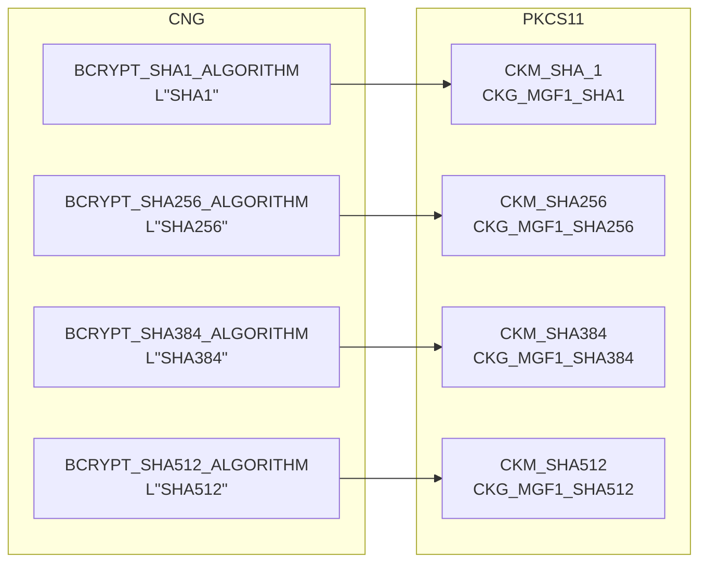
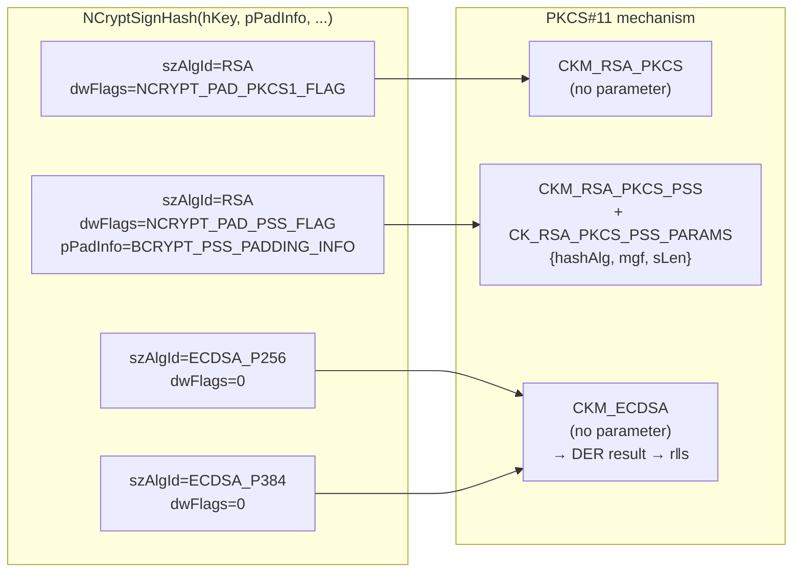
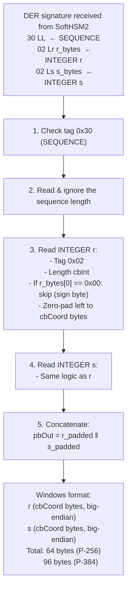
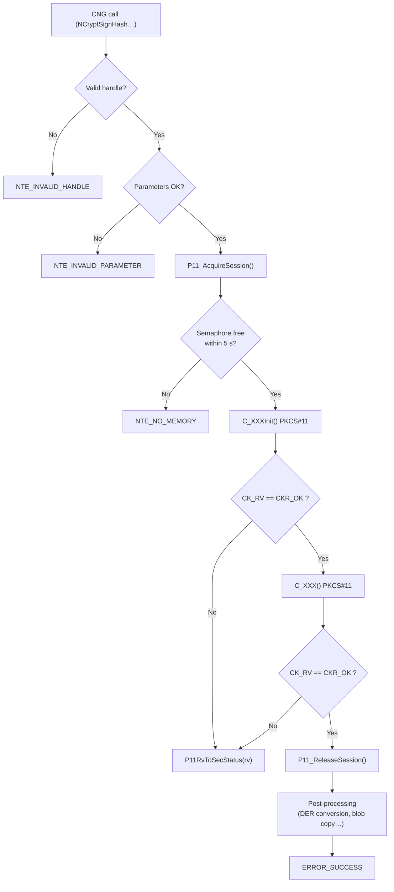

# Error mapping and format conversions

## CK_RV → SECURITY_STATUS conversion

The `P11RvToSecStatus()` function in `p11_utils.c` performs this mapping:

| PKCS#11 code (`CK_RV`) | CNG code (`SECURITY_STATUS`) | Meaning |
|------------------------|------------------------------|---------|
| `CKR_OK` | `ERROR_SUCCESS` | Success |
| `CKR_HOST_MEMORY` | `NTE_NO_MEMORY` | Insufficient memory |
| `CKR_ARGUMENTS_BAD` | `NTE_INVALID_PARAMETER` | Invalid argument |
| `CKR_BUFFER_TOO_SMALL` | `NTE_BUFFER_TOO_SMALL` | Buffer too small |
| `CKR_FUNCTION_NOT_SUPPORTED` | `NTE_NOT_SUPPORTED` | Feature not available |
| `CKR_KEY_HANDLE_INVALID` | `NTE_BAD_KEY` | Invalid key handle |
| `CKR_KEY_SIZE_RANGE` | `NTE_BAD_LEN` | Key size out of range |
| `CKR_KEY_TYPE_INCONSISTENT` | `NTE_BAD_ALGID` | Incompatible key type |
| `CKR_MECHANISM_INVALID` | `NTE_BAD_ALGID` | Unsupported mechanism |
| `CKR_MECHANISM_PARAM_INVALID` | `NTE_BAD_ALGID` | Invalid mechanism parameters |
| `CKR_OBJECT_HANDLE_INVALID` | `NTE_BAD_KEY` | Invalid object handle |
| `CKR_PIN_INCORRECT` | `NTE_BAD_KEYSET_PARAM` | Incorrect PIN |
| `CKR_PIN_LOCKED` | `NTE_BAD_KEYSET_PARAM` | PIN locked (too many attempts) |
| `CKR_SESSION_HANDLE_INVALID` | `NTE_FAIL` | Invalid session handle |
| `CKR_SIGNATURE_INVALID` | `NTE_BAD_SIGNATURE` | Incorrect signature |
| `CKR_SIGNATURE_LEN_RANGE` | `NTE_BAD_LEN` | Invalid signature length |
| `CKR_TOKEN_NOT_PRESENT` | `NTE_NO_KEY` | Token absent or inaccessible |
| `CKR_USER_NOT_LOGGED_IN` | `NTE_BAD_KEYSET_PARAM` | User not logged in |
| `CKR_KEY_UNEXTRACTABLE` | `NTE_NOT_SUPPORTED` | Non-exportable key |
| `CKR_CRYPTOKI_NOT_INITIALIZED` | `NTE_FAIL` | Library not initialised |
| Any other code | `NTE_FAIL` | Generic error |

---

## KSP function return codes

### KSP_OpenProvider / KSP_FreeProvider

| Condition | Return code |
|-----------|------------|
| `ppProvider == NULL` | `NTE_INVALID_PARAMETER` |
| `LoadLibrary` fails | `NTE_PROVIDER_DLL_FAIL` |
| No SoftHSM2 token | `NTE_NO_KEY` |
| Invalid handle (Free) | `NTE_INVALID_HANDLE` |
| Success | `ERROR_SUCCESS` |

### KSP_CreatePersistedKey

| Condition | Return code |
|-----------|------------|
| `phKey == NULL` | `NTE_INVALID_PARAMETER` |
| Unknown algorithm | `NTE_BAD_ALGID` |
| `HeapAlloc` fails | `NTE_NO_MEMORY` |
| `C_GenerateKeyPair` fails | `P11RvToSecStatus(rv)` |
| Success | `ERROR_SUCCESS` |

### KSP_OpenKey

| Condition | Return code |
|-----------|------------|
| Key not found (label absent) | `NTE_BAD_KEYSET` |
| Session unavailable | `NTE_NO_MEMORY` |
| Success | `ERROR_SUCCESS` |

### KSP_SignHash

| Condition | Return code |
|-----------|------------|
| `pbHashValue == NULL` | `NTE_INVALID_PARAMETER` |
| Key not finalised | `NTE_KEY_DOES_NOT_EXIST` |
| Unsupported algorithm | `NTE_BAD_ALGID` |
| Signature buffer too small | `NTE_BUFFER_TOO_SMALL` |
| `C_SignInit` fails | `P11RvToSecStatus(rv)` |
| `C_Sign` fails | `P11RvToSecStatus(rv)` |
| Invalid DER (ECDSA) | `NTE_INVALID_PARAMETER` |
| Success | `ERROR_SUCCESS` |

### KSP_ExportKey

| Condition | Return code |
|-----------|------------|
| Private blob type requested | `NTE_NOT_SUPPORTED` |
| Invalid `hPubKey` | `NTE_BAD_KEY` |
| Unknown blob type | `NTE_NOT_SUPPORTED` |
| Buffer too small | `NTE_BUFFER_TOO_SMALL` |
| Success | `ERROR_SUCCESS` |

---

## CNG → PKCS#11 algorithm conversion

### Hash algorithms (PSS and OAEP)



### Signing mechanisms



---

## ECDSA signature format conversion

### DER format (PKCS#11) → Windows CNG format



### Concrete example (P-256, r and s of 31 bytes after trimming)

```
DER input (70 bytes):
  30 44
    02 1F  ← r without sign byte (31 significant bytes)
      AA BB CC ... (31 bytes)
    02 21  ← s with sign byte 0x00 (32 + 1 = 33 raw bytes)
      00 DD EE FF ... (1 + 32 bytes)

Processing r:
  cbInt=31, no leading 0x00
  left-pad: 00 || AA BB CC ... (32 bytes)
  → pbOut[0..31] = 00 AA BB CC ...

Processing s:
  cbInt=33, r_bytes[0]=0x00 → skip, cbInt=32
  → pbOut[32..63] = DD EE FF ...

Windows output (64 bytes):
  00 AA BB CC ... DD EE FF ...
  ←── r (32 bytes) ──→←── s (32 bytes) ──→
```

---

## Complete error flow diagram


