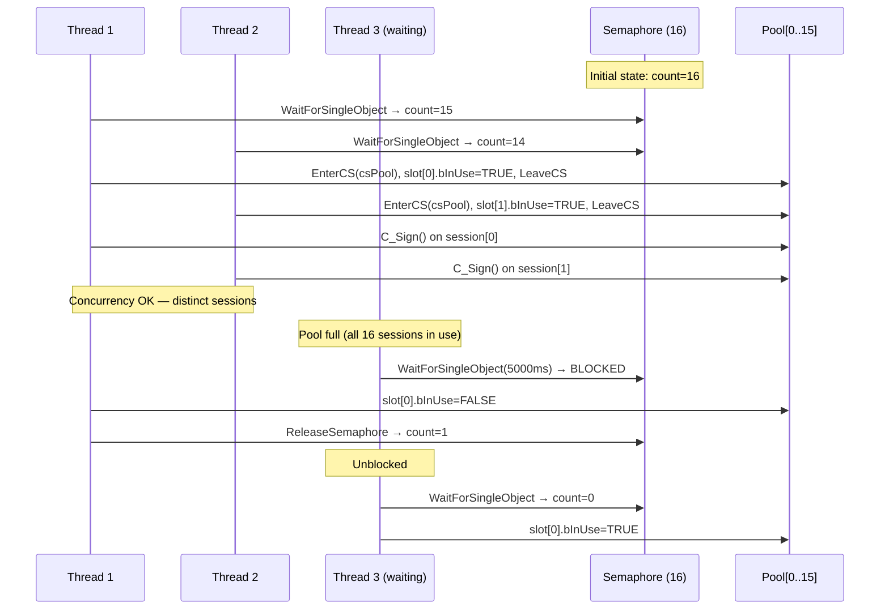
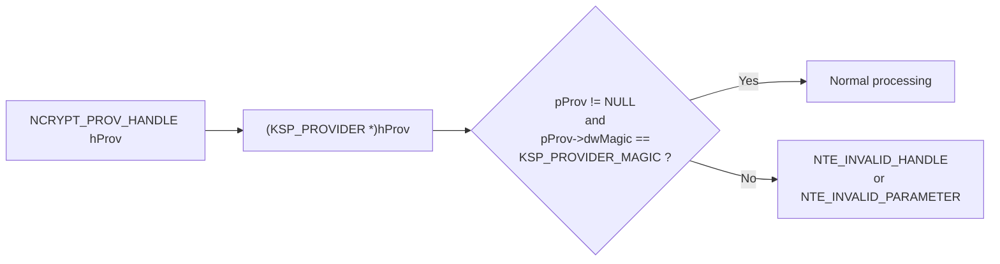
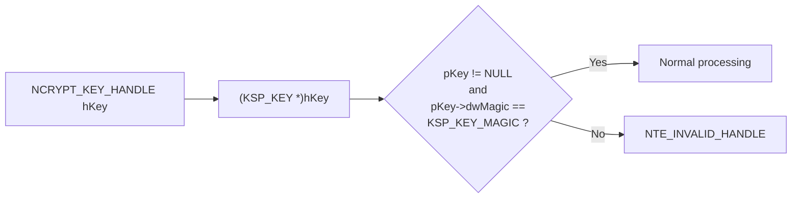
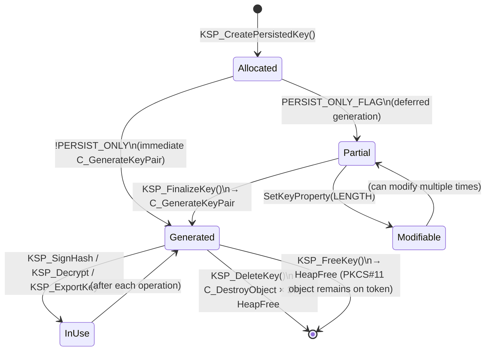
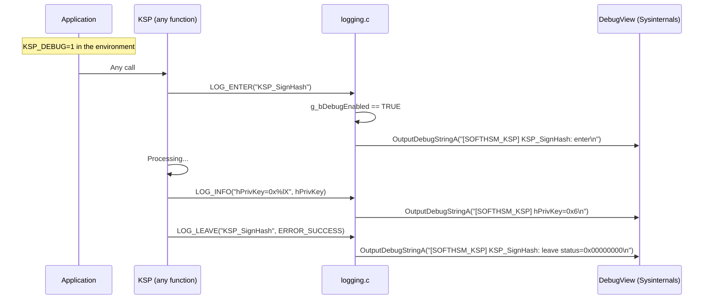

# Security and threading

## Concurrency model

### Thread-safety guarantees

| Component | Mechanism | Scope |
|-----------|-----------|-------|
| Singleton initialisation | `InitOnceExecuteOnce` | Entire process |
| Session pool | `CreateSemaphore` (counter) | Pool access |
| Free slot search | `CRITICAL_SECTION csPool` | Slot list |
| Per-session operation | `CRITICAL_SECTION cs[i]` | Individual session |
| SoftHSM2 (internal) | `CKF_OS_LOCKING_OK` | PKCS#11 library |

### Key invariant

> Two threads can perform cryptographic operations **simultaneously**
> because each uses a distinct session from the pool (different `CK_SESSION_HANDLE`).
> `CKF_OS_LOCKING_OK` guarantees that SoftHSM2 itself is thread-safe internally.

---

## Diagram — Concurrent access to the session pool



---

## Secure PIN handling

```mermaid
flowchart TD
    A["GetEnvironmentVariableA(SOFTHSM2_PIN_ENV,\nszPin, sizeof szPin)"]
    A --> B{Variable defined?}
    B -- No --> C["szPin = SOFTHSM2_PIN_DEFAULT\n= '1234'"]
    B -- Yes --> D["szPin = value read"]
    C --> E["C_Login(hSession, CKU_USER,\nszPin, strlen(szPin))"]
    D --> E
    E --> F["SecureZeroMemory(szPin, sizeof szPin)"]
    note right of F: Immediately erases the PIN<br/>from the stack/heap to prevent<br/>it from remaining accessible in memory
    F --> G["CK_RV result"]
```

> **Production recommendation**: never store the PIN in an environment variable
> in production. Use a secrets vault (Windows DPAPI, Azure Key Vault, etc.)

---

## Handle validation

Every KSP function validates incoming handles before any processing:





The magic numbers serve as canaries: if a caller passes an arbitrary pointer
or a handle from another provider, the magic check fails before any potentially
dangerous dereference.

---

## Complete lifecycle of a KSP_KEY object



---

## Security countermeasures

### Non-exportable keys

All private keys are created with:
```c
{ CKA_EXTRACTABLE, &bFalse, sizeof(bFalse) }  // FALSE
{ CKA_SENSITIVE,   &bTrue,  sizeof(bTrue)  }  // TRUE
```

Attempting to export a private key → immediate `NTE_NOT_SUPPORTED` (without any PKCS#11 call).

### No static link to softhsm2.dll

The DLL is loaded via `LoadLibrary` only, which avoids:
- Build-time dependency
- ABI compatibility issues between versions
- Unnecessary loading when SoftHSM2 is absent

### Sensitive memory zeroing

- PIN: `SecureZeroMemory()` after `C_Login()`
- Hash and signature buffers are **not** zeroed because they are not secret

---

## Logging and debugging



### Log message format

```
[SOFTHSM_KSP] <FunctionName>: enter
[SOFTHSM_KSP] <FunctionName>: <key>=<value>
[SOFTHSM_KSP] <FunctionName>: leave status=0x00000000
[SOFTHSM_KSP] <FunctionName>: ERROR status=0x80090009
```
