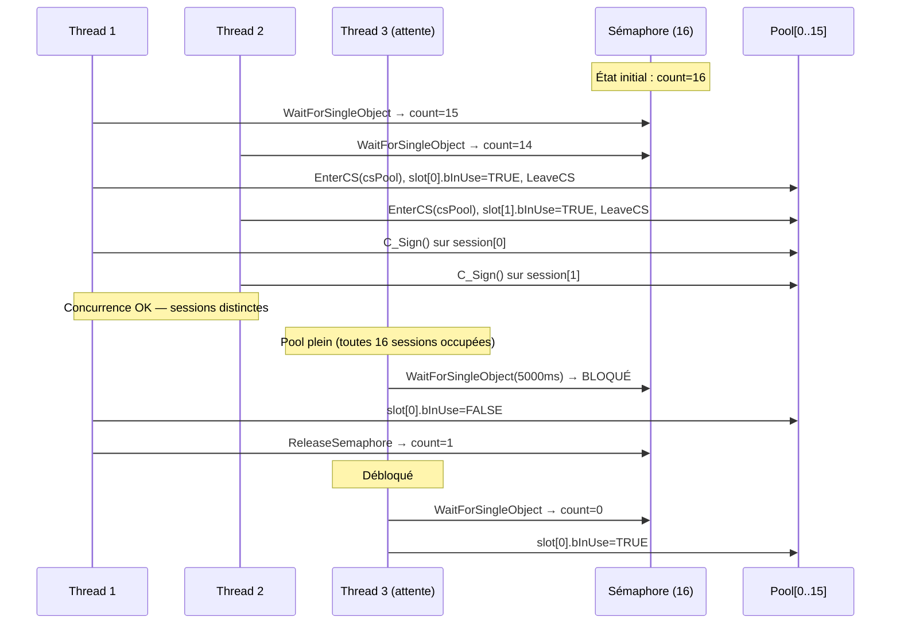
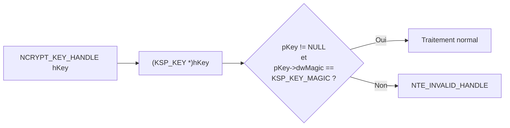
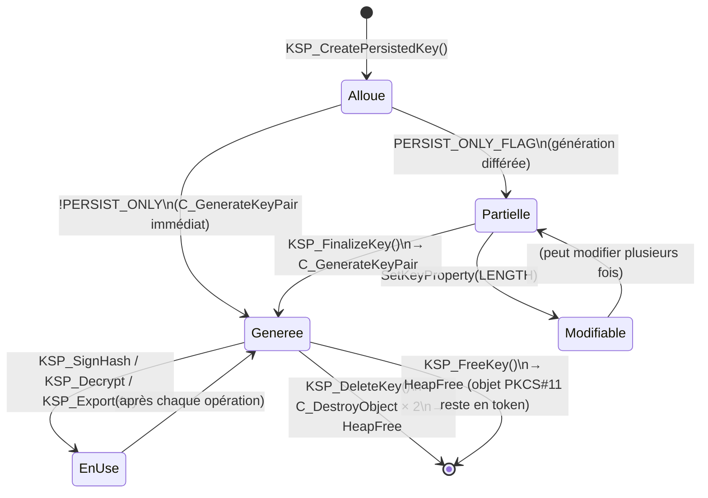

# Sécurité et threading

## Modèle de concurrence

### Garanties de thread-safety

| Composant | Mécanisme | Portée |
|-----------|-----------|--------|
| Initialisation singleton | `InitOnceExecuteOnce` | Processus entier |
| Pool de sessions | `CreateSemaphore` (compteur) | Accès au pool |
| Recherche slot libre | `CRITICAL_SECTION csPool` | Liste des slots |
| Opération par session | `CRITICAL_SECTION cs[i]` | Session individuelle |
| SoftHSM2 (interne) | `CKF_OS_LOCKING_OK` | Bibliothèque PKCS#11 |

### Invariant clé

> Deux threads peuvent effectuer des opérations cryptographiques **simultanément**
> car chacun utilise une session distincte du pool (handle `CK_SESSION_HANDLE` différent).
> `CKF_OS_LOCKING_OK` garantit que SoftHSM2 lui-même est thread-safe en interne.

---

## Diagramme — Accès concurrent au pool de sessions



---

## Gestion sécurisée du PIN

```mermaid
flowchart TD
    A["GetEnvironmentVariableA(SOFTHSM2_PIN_ENV,\nszPin, sizeof szPin)"]
    A --> B{Variable définie ?}
    B -- Non --> C["szPin = SOFTHSM2_PIN_DEFAULT\n= '1234'"]
    B -- Oui --> D["szPin = valeur lue"]
    C --> E["C_Login(hSession, CKU_USER,\nszPin, strlen(szPin))"]
    D --> E
    E --> F["SecureZeroMemory(szPin, sizeof szPin)"]
    note right of F: Efface immédiatement le PIN\nde la pile/heap pour éviter\nqu'il reste accessible en mémoire
    F --> G["Résultat CK_RV"]
```

> **Recommandation production** : ne jamais stocker le PIN dans une variable d'environnement
> en production. Utiliser un coffre-fort de secrets (Windows DPAPI, Azure Key Vault, etc.)

---

## Validation des handles

Chaque fonction KSP valide les handles entrants avant tout traitement :




Les magic numbers servent de canaries : si un appelant passe un pointeur arbitraire
ou un handle d'un autre fournisseur, la vérification du magic échoue avant
tout déréférencement potentiellement dangereux.

---

## Cycle de vie complet d'un objet KSP_KEY



---

## Contre-mesures de sécurité

### Clés non exportables

Toutes les clés privées sont créées avec :
```c
{ CKA_EXTRACTABLE, &bFalse, sizeof(bFalse) }  // FALSE
{ CKA_SENSITIVE,   &bTrue,  sizeof(bTrue)  }  // TRUE
```

Tentative d'export de clé privée → `NTE_NOT_SUPPORTED` immédiat (sans appel PKCS#11).

### Pas de lien statique softhsm2.dll

La DLL est chargée via `LoadLibrary` uniquement, ce qui évite :
- La dépendance au moment du build
- Les problèmes d'ABI entre versions
- Le chargement inutile en l'absence de SoftHSM2

### Zeroing de la mémoire sensible

- PIN : `SecureZeroMemory()` après `C_Login()`
- Les buffers de hash et de signature ne sont **pas** zéroïsés car ils ne sont pas secrets

---

## Logging et débogage


### Format des messages de log

```
[SOFTHSM_KSP] <NomFonction>: entree
[SOFTHSM_KSP] <NomFonction>: <clé>=<valeur>
[SOFTHSM_KSP] <NomFonction>: sortie status=0x00000000
[SOFTHSM_KSP] <NomFonction>: ERREUR status=0x80090009
```
