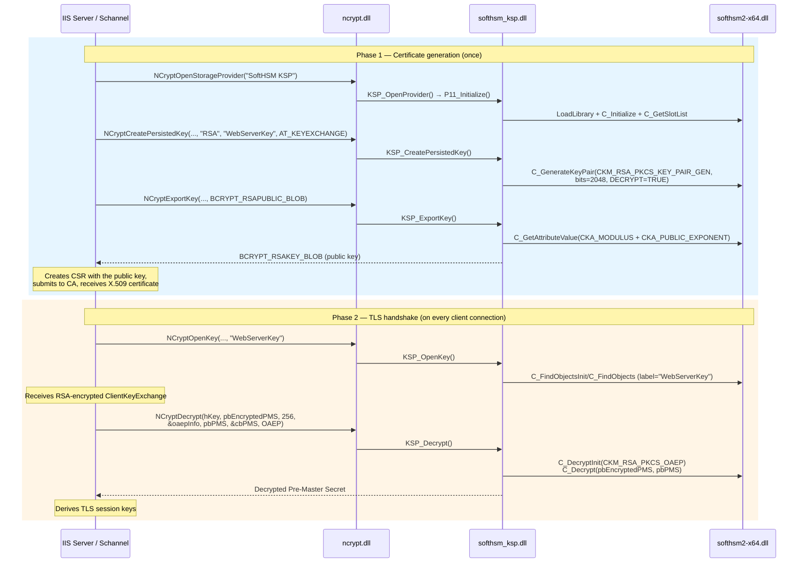
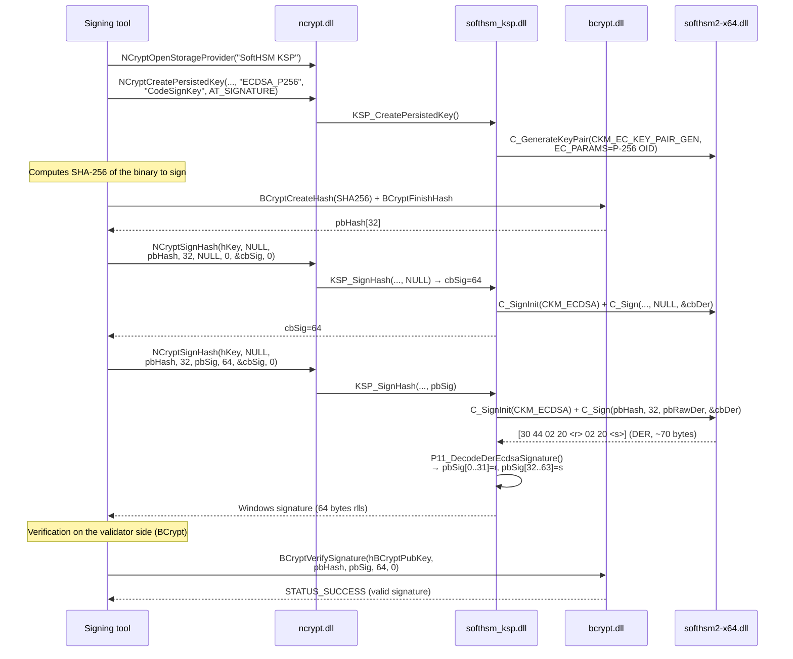
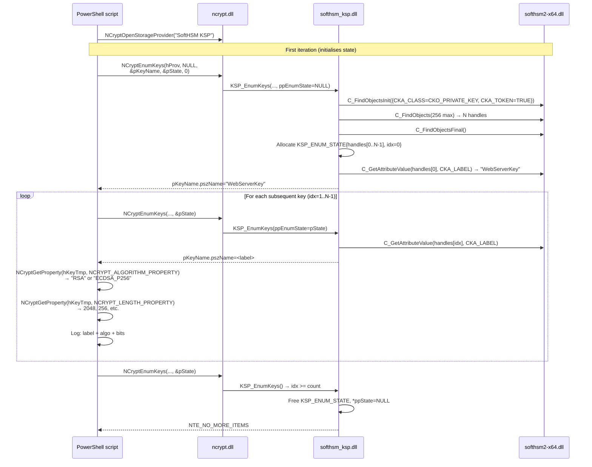
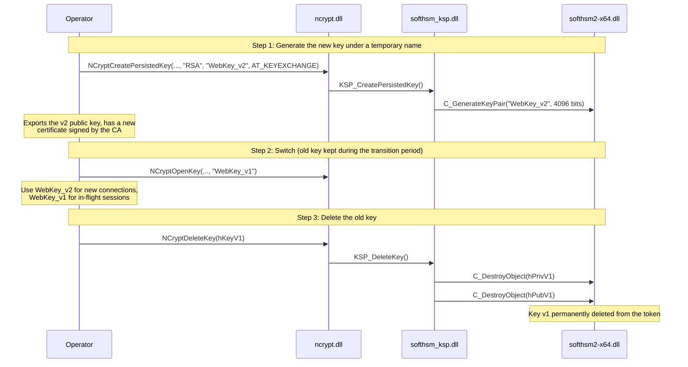
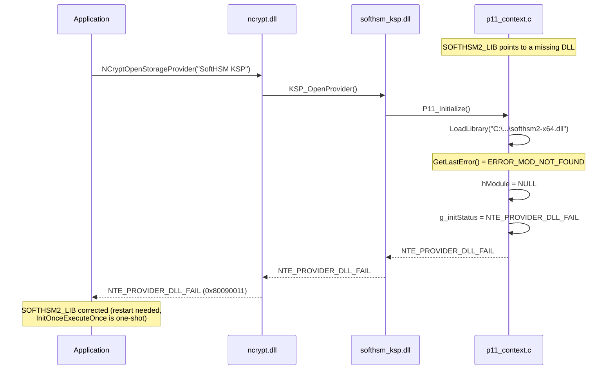
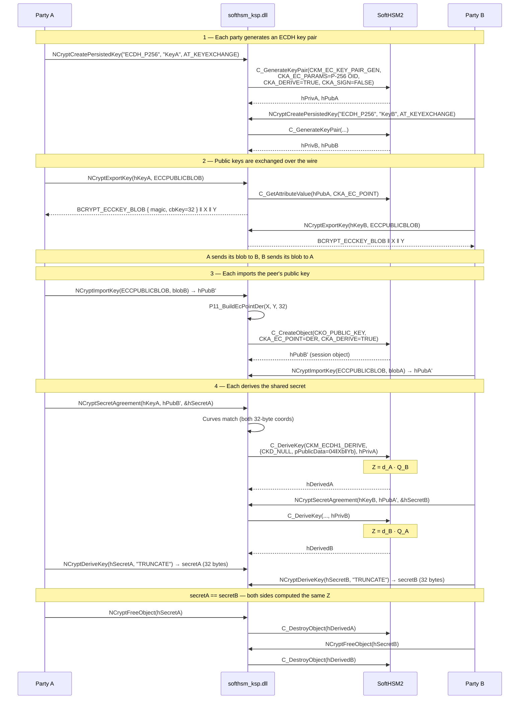
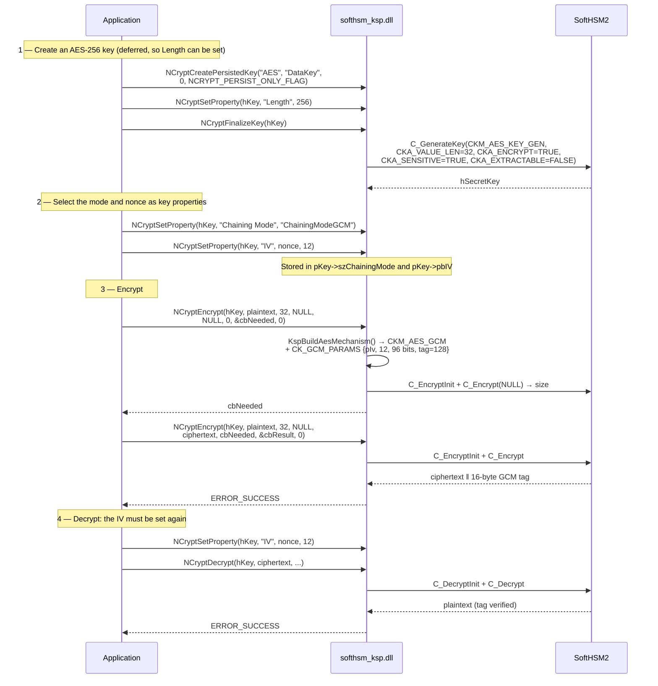
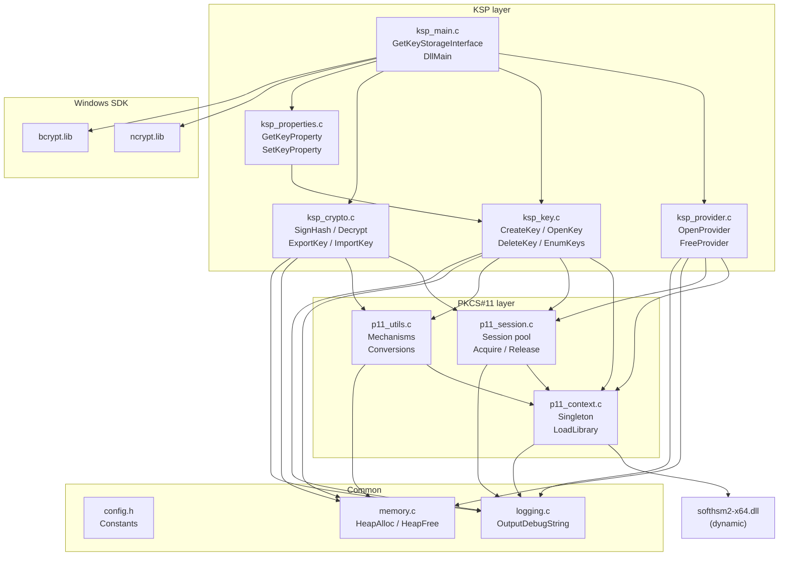

# End-to-end flows — Complete scenarios

## Scenario 1: Generating and using an RSA key for TLS signing

This scenario illustrates the complete flow from an application (e.g. IIS/Schannel server)
to SoftHSM2.

---

## Scenario 2: Code signing with ECDSA P-256

---

## Scenario 3: Key enumeration and audit

---

## Scenario 4: Key rotation

---

## Scenario 5: Error recovery — Missing token

> **Limitation**: `InitOnceExecuteOnce` executes the callback exactly once
> per process, even on failure. If the SoftHSM2 DLL is absent on the first
> call, the process must be restarted after correcting the path.

---

## Scenario 6: ECDH key agreement between two parties

The strongest end-to-end test in the suite: two independently generated key
pairs must arrive at the same shared secret. This is the ECDHE handshake at
the heart of TLS 1.3.

The mathematics behind the assertion: `d_A · Q_B = d_A · (d_B · G) =
d_B · (d_A · G) = d_B · Q_A`. Integration test 27 and HLK section S11 both
assert the two derived buffers are byte-identical, which fails if the DER
point unwrapping or the curve check is wrong.

> Attempting agreement across different curves (P-256 private with a P-384
> peer) returns `NTE_BAD_ALGID` before any PKCS#11 call.

---

## Scenario 7: AES data encryption

> **The IV is consumed by the operation.** Re-set
> `NCRYPT_INITIALIZATION_VECTOR` before the matching decrypt, exactly as
> BCrypt requires. Forgetting this is the most common AES integration bug.

---

## Module dependency overview

