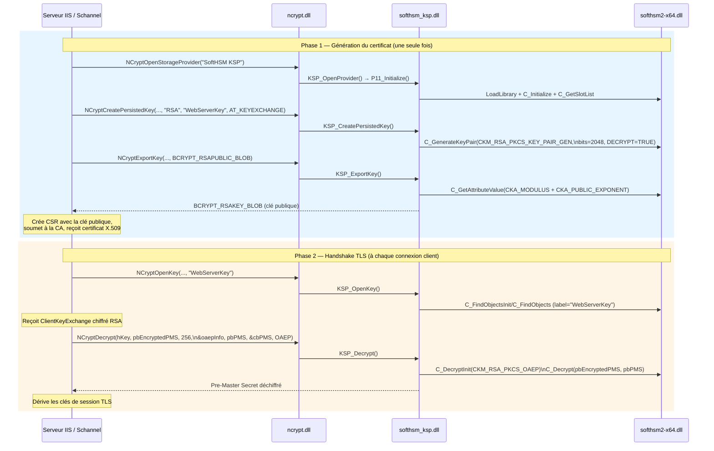
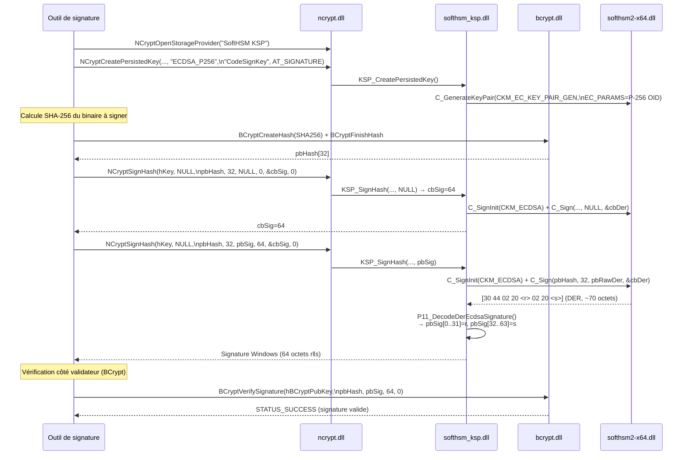
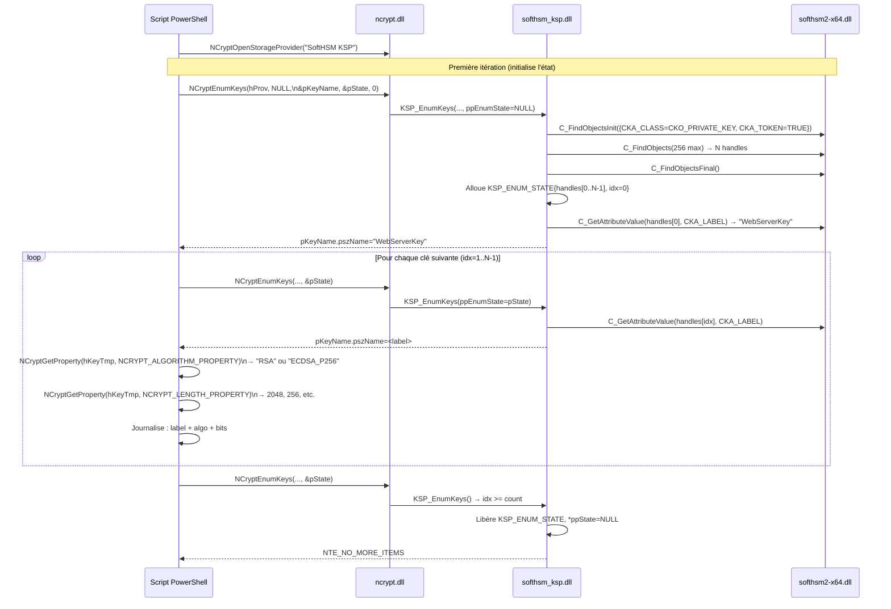
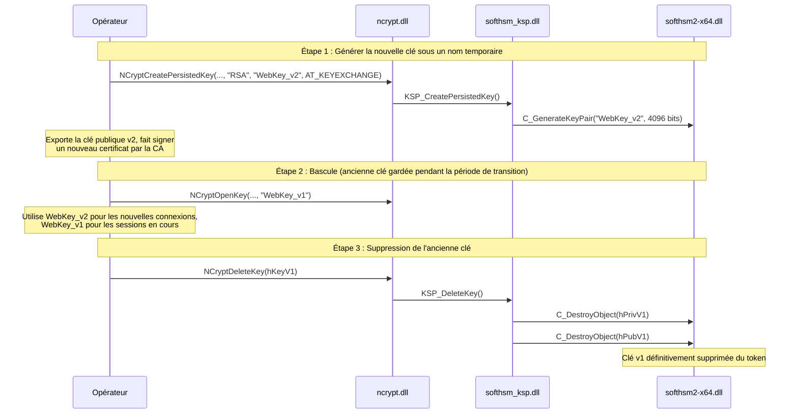
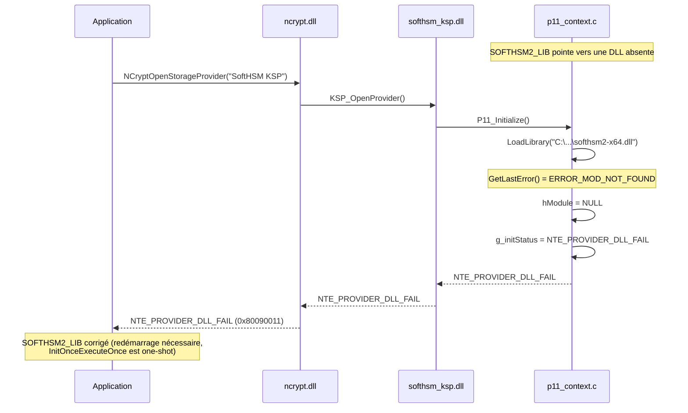
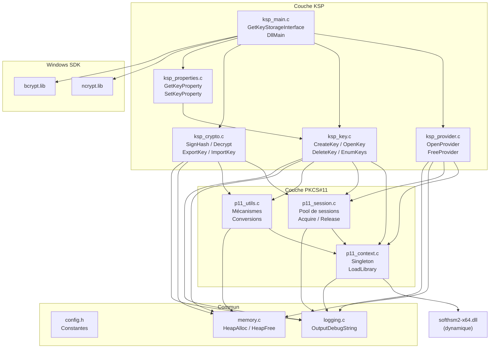

# Flux de bout en bout — Scénarios complets

## Scénario 1 : Génération et utilisation d'une clé RSA pour signature TLS

Ce scénario illustre le flux complet depuis une application (ex: serveur IIS/Schannel)
jusqu'à SoftHSM2.

---

## Scénario 2 : Signature de code avec ECDSA P-256

---

## Scénario 3 : Énumération et audit des clés

---

## Scénario 4 : Rotation de clé

---

## Scénario 5 : Récupération d'erreur — Token absent

> **Limitation** : `InitOnceExecuteOnce` exécute le callback exactement une fois
> par processus, même en cas d'échec. Si la DLL SoftHSM2 est absente au premier
> appel, le processus devra être redémarré après correction du chemin.

---

## Vue d'ensemble des dépendances entre modules

